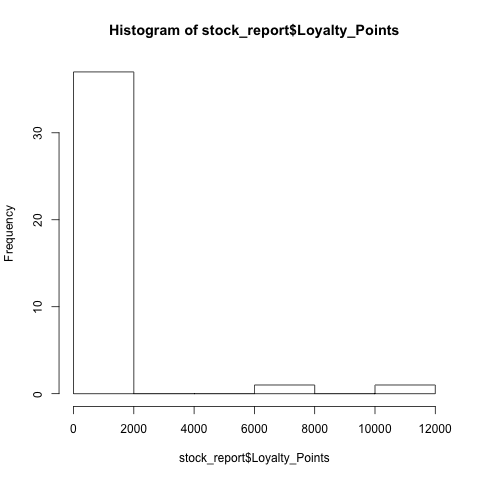
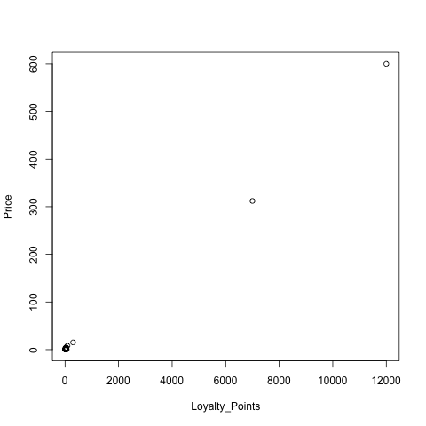

#MAT013 - R: C1+C2 - Challenge Sheet

#Introduction and Basic Statistics Challenge
Let us first import the data:

    stock_report<-read.csv("~/Downloads/Stock_Report.csv")

#Initial investigation
Let us take a look at the structure of our data set:

    str(stock_report)

We have 39 observations with 4 variables. To make sure that the first row is the header let us find the names of our variables:

    names(stock_report)

#Number of products in each department

An initial investigation of the data can further be obtained using the summary function:

    summary(stock_report)

This immediately gives the number of products in each department:

- Bakery: 7
- Drinks: 6
- Food cupboard: 12
- Fresh Food: 8
- Home and entertainment:

#Variation

The above gives some initial statistics that shows quite a high level of variation in price. We can also take a look at some histograms:

    hist(stock_report$Price)
    hist(stock_report$Loyalty_Points)

#Relationship:

    with(stock_report,cor.test(Loyalty_Points,Price))

This seems to indicate that there is a high correlation between Loyalty Points and Price *however* a quick plot shows that the situation might be a bit more complicated:

    with(stock_report,plot(Loyalty_Points,Price))

