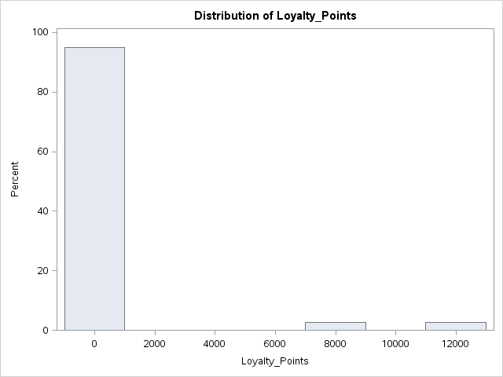
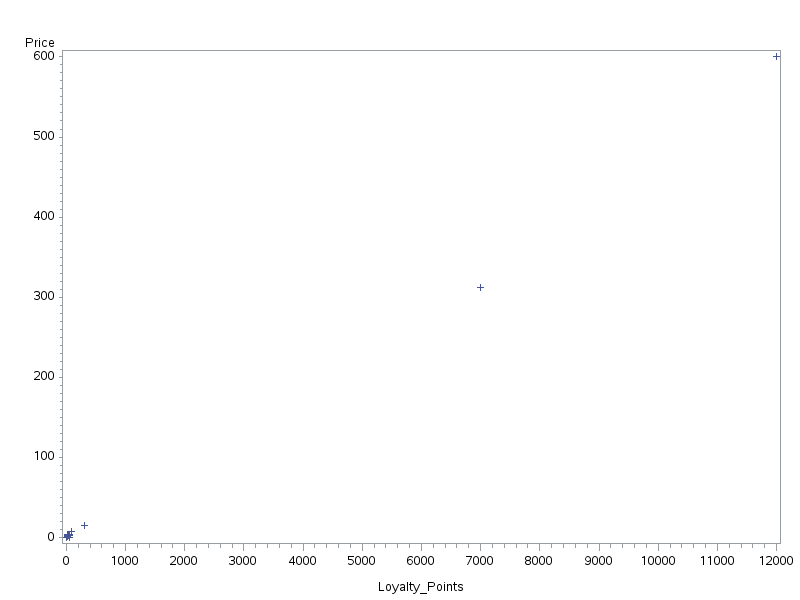

#MAT013 - SAS: C1+C2 - Challenge Sheet

#Introduction and Basic Statistics Challenge
Let us first import the data:

    proc import datafile="~/Downloads/Stock_Report.csv"
        out=mat013.stock_report
        dbms=csv
        replace;
        getnames=yes;
    run;

#Initial investigation
Let us take a look at the structure of our data set:

    proc contents data=mat013.stock_report;
    run;

We have 39 observations with 4 variables.

#Number of products in each department

An initial investigation of the data can further be obtained using proc freq:

    proc freq data=mat013.stock_report;
    run;

This immediately gives the number of products in each department:

- Bakery: 7
- Drinks: 6
- Food cupboard: 12
- Fresh Food: 8
- Home and entertainment: 6

#Variation

A means procedure indicates quite a lot of variation:

    proc means data=mat013.stock_report;
    run;

This can also be seen using histograms:

    proc univariate data=mat013.stock_report;
    var Price Loyalty_Points;
    histogram;
    run;

#Relationship:

    proc corr data=mat013.stock_report;
    run;

This seems to indicate that there is a high correlation between Loyalty Points and Price *however* a quick plot shows that the situation might be a bit more complicated:

    proc gplot data=mat013.stock_report;
    plot Price*Loyalty_Points;
    run;

