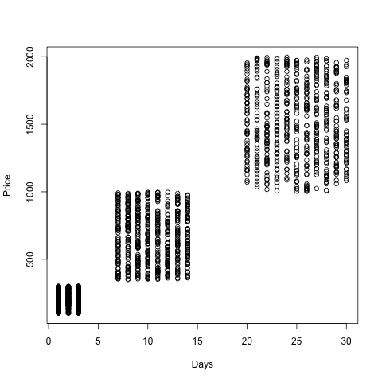

#MAT013 - R: C1+C2 - Challenge Sheet
#The first thing we need to do is import all the data:

    Dates_1996<-read.csv("~/Downloads/Dates_1996.csv")
    Prices_1996<-read.csv("~/Downloads/Prices_1996.csv")
    Holidays_1995<-read.csv("~/Downloads/Holidays_1995.csv")

#Merging Dates and Prices:

    Holidays_1996<-merge(Dates_1996,Prices_1996,by="Id")

We can briefly check our data is ok by checking the structure of both data sets:

    str(Holidays_1996)
    str(Holidays_1995)

#Concatenating 1995 and 1996:

    Holidays=rbind(Holidays_1995,Holidays_1996)

We can briefly check that this looks ok:

    head(Holidays)
    tail(Holiday)

#Handling dates:

    Holidays$Start_Date<-as.Date(Holidays$Start_Date,"%d/%m/%Y")
    Holidays$End_Date<-as.Date(Holidays$End_Date,"%d/%m/%Y")

#Creating a new variable:

    Holidays<-within(Holidays,Days<-End_Date-Start_Date)

#Let us plot price versus days:

    with(Holidays,plot(Days,Price))

#It looks like we have three groups, with the following we shall get the mean price of a holiday in the 3 groups:

    with(Holidays[Holidays$Days<5,],mean(Price))
    with(Holidays[Holidays$Days<18 & Holidays$days>5,],mean(Price))
    with(Holidays[Holidays$Days>18,],mean(Price))

The mean prices are given:

- 211.36 for short holidays
- 673.52 for medium holidays
- 1512.34 for long holidays
