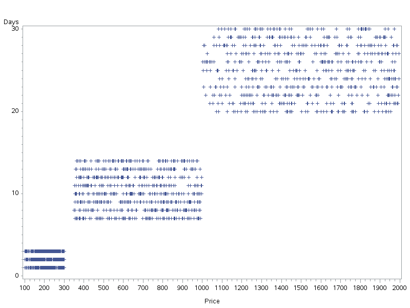

#MAT013 - SAS: C3 - Challenge Sheet
#The first thing we need to do is import all the data:

    proc import datafile='~/Downloads/Dates_1996.csv'
        out=mat013.Dates_1996;
        getnames=yes;
    run;

    proc import datafile='~/Downloads/Prices_1996.csv'
        out=mat013.Prices_1996;
        getnames=yes;
    run;

    proc import datafile='~/Downloads/Holidays_1995.csv'
        out=mat013.Holidays_1995;
        getnames=yes;
    run;

#Merging Dates and Prices:

    data mat013.Holidays_1996;
        merge mat013.Dates_1996 mat013.Prices_1996;
        by Id;
    run;

We can briefly check our data is ok using proc contents:

    str(Holidays_1996)
    str(Holidays_1995)

(This in fact shows that the dates have been handled correctly)

#Concatenating 1995 and 1996 and creating the new variable:

    data mat013.Holidays;
    set mat013.Holidays_1995 mat013.Holidays_1996;
    Days=End_Date-Start_Date;
    run;

#Let us plot price versus days:

    with(Holidays,plot(Days,Price))

#It looks like we have three groups, with the following we shall get the mean price of a holiday in the 3 groups:

    proc means data=mat013.Holidays;
    where Days<5;
    run;

    proc means data=mat013.Holildays;
    where Days>=5 and Days<18;
    run;

    proc means data=mat013.Holidays;
    where Days>=18;
    run;

The mean prices are given:

- 211.36 for short holidays
- 673.52 for medium holidays
- 1512.34 for long holidays
