# MAT013: Advanced Use of Statistical Packages
## Table of Contents

Chapter 1 - Introduction

1.  The Environment
2.  Objects
3.  Importing Data
4.  Exporting Data

Chapter 2 - Basic Statistical Procedures

1.  Procedures
2.  A list of procedures
3.  Exporting output

Chapter 3 - Manipulating Data

1.  Vectors and data frames
2.  Merging and concatenating data sets
3.  Creating new variables
4.  Handling dates

Chapter 4 - Programming

1.  Flow control
2.  Functions
3.  Handling strings
4.  Memory and scripts

Chapter 5 - Further Packages

1.  sqldf
2.  functions
3.  optimisation

---

# Chapter 1 - Introduction

---

## 1.1 The Environment

R can be run in a number of different modes, for the purpose of this course we will be focusing on 'interactive mode' through the graphical user interface (GUI); 'batch mode' is also available but will not be covered here. Note that the screenshots and accompanying screencasts for this course were produced with R version 2.14 running on Mac OSX The look and feel on other operating systems will differ slightly.

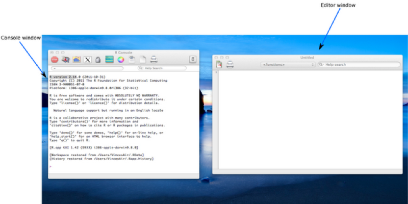

The visible windows are:

1. The editor window
2. The console

We can write commands directly into the console window or we can create a script file and edit it in the editor window, highlighting specific text we wish to run. The second approach has the benefit of being able to save the commands written in the script files, although it takes more time (and in fact the commands we write directly in the console can also be saved to a file).

When writing scripts it is good practice to include comments in our files that help describe what the code does. The way to do this in R is with the "#" symbol before text. The following code is ignored by R:

    #2+2

Using the highlight + run approach is akin to copying and pasting the text in the interpreter but R scripts can also be run directly (so that they can be run on servers or as routines without the need to have a user interact).

## 1.2 Objects

R is an extremely versatile programming language. In particular R is an "object oriented language". The significance of this is that everything (functions, data files, outputs of a regression analysis) is an "object". The type of object is called the "class" and what one can do to a class is called a "method". The advantage of this is that when a new "class" is developed one simply needs to ensure that is has relevant "methods", to be compatible with other objects.

As an example, various objects in R have a "plot" method, for example the output of a regression analysis can be plotted using the same command as one would use to plot a scatter plot of a data set.

R has a wide range of data types (which are themselves objects). The 2 classes corresponding to data sets we will concentrate on in this course
are:

1. Vectors
2. Data frames

Vectors are simply collections of variables of a particular type ("Numeric", "Character", "Boolean" etc). In R a type of variable is called a "mode", representing how it is stored in the computer memory. Data frames are collections of vectors and correspond to data sets. Technically, data frames are lists with dimensions, which are themselves just generic vectors. One might say a collection of equal length vectors (thus allowing the rectangular shape). Some examples of vectors and data frames are shown.

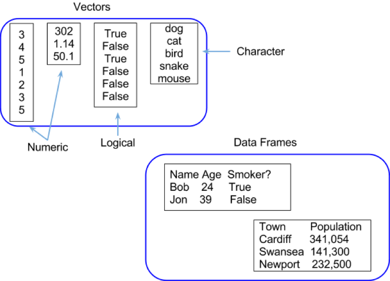

Let's import some data!

## 1.3 Importing Data

We will consider two approaches to importing data:

1. Direct input
2. Importing an external data set (xls, csv etc...)

In practice you will never use the direct input method but let's take a look for completeness (although it is very useful when wanting to quickly test a few things). This will also give us our first experience of the editor window!

Let us create a data set named `first_data_set` which will include the following data:

Name,Age
Bob,23
Billy,25

To do so write the following code in the editor window:

    Name <- c("Bob","Billy")
    Age <- c(23,25)
    first_data_set <- data.frame(Name,Age)

Let's take a look at the shown screenshot of this. You may notice that some elements of the text are highlighted, this is to emphasise key words (note that this doesn't happen automatically on Windows).

1. The first two lines of code make use of the "<-" operator that assigns an object to a variable.
2. The objects in questions are created using the "c"(ombine) function that creates a vector. We use this to create 2 vectors: Name and Age.
3. Finally we put the 2 vectors into a data frame using the "data.frame" command.

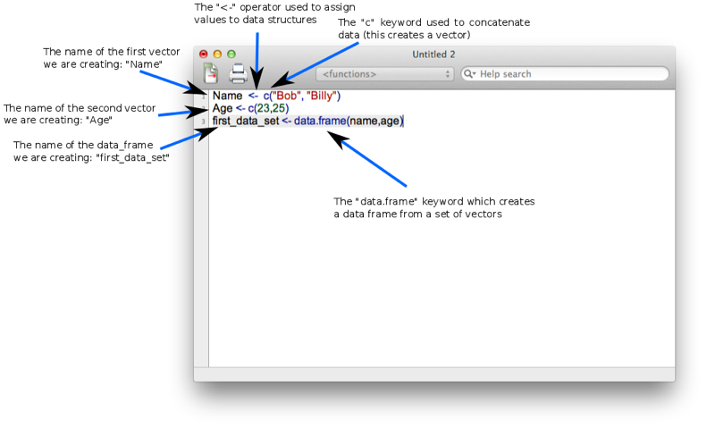

We run this code by highlighting it and pressing ctrl + 'r' (cmd + enter on Mac). Note that when we submit code this way it also appears in the console window. We could have in fact directly type this code into the console window. For those familiar with command line commands the console works in a very similar way. We can press the up arrow repeatedly to cycle through previous commands and use tab to autocomplete.

The data set "first_data_set" is now saved to memory. To view all the data structures in memory we use the simple line of code:

    ls()

A screenshot of the output is shown. We see that there are actually 3 objects in memory, the two vectors (Name and Age) as well as the data frame (first_data_set).

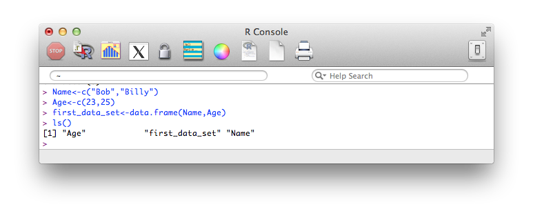

To view our data set, we simply type the name (as shown):

    first_data_set

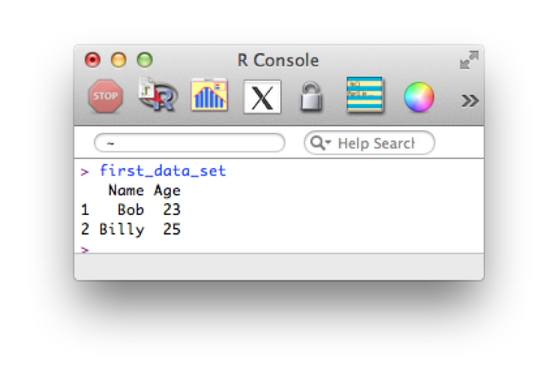

Using direct input is of course not at all realistic when trying to import larger data sets.

Often large data sets will be saved in comma-separated values (csv) format which can be read by most (all?) software. We will import the data set shown (here viewed in a simple text editor).

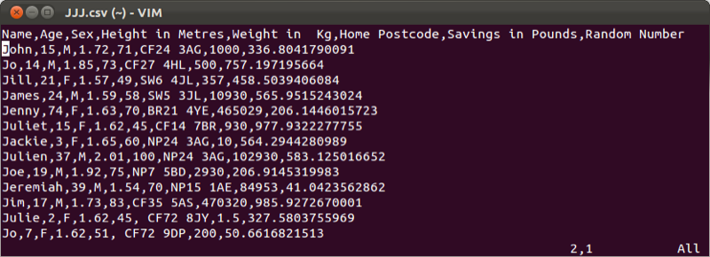

We will import this data set into R using the following code:

    JJJ <- read.csv(file="~/JJJ.csv",head=TRUE)

Let's take a look at the screenshot shown. Note here that we are not using the text editor but directly writing code in the console (this is often how I prefer to use R for short bits of code).

1. "read.csv" - is the command which is used to tell R to read in data from a csv file.
2. "file" - an option tells R where the csv file is located.
3. "head" - an option tells R to read the variable names from the first row of the csv file. Note that this command can be omitted (the default value is "TRUE").

We have omitted other options (such as "sep" which can be used to change the default separator from "," to something else).

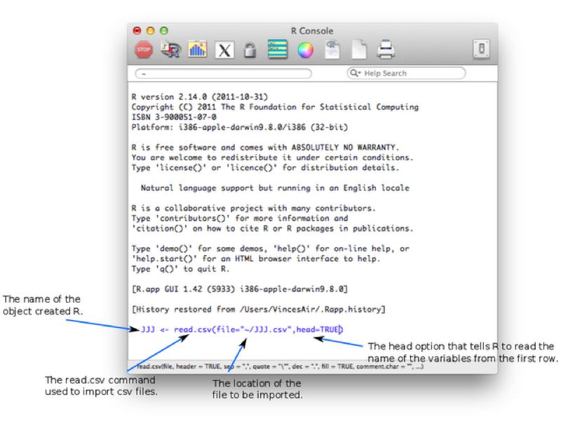

Running the code (by either pressing enter if using the console or highlighting and running as before is using the editor) gives the required object as shown.

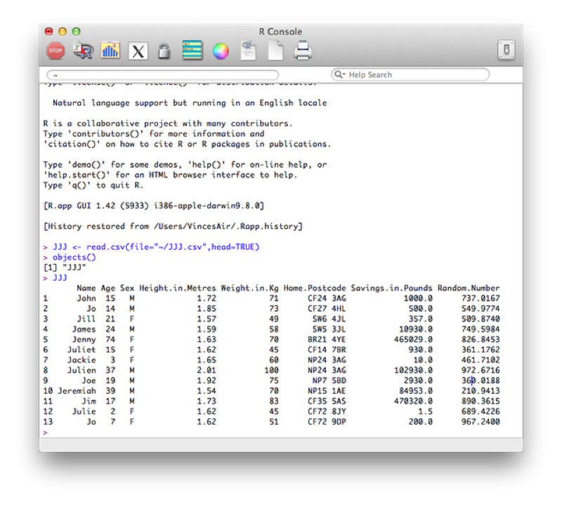

In the following chapters we will learn how to create new data sets from old data sets and as such it may become necessary to export files to csv.

## 1.3 Exporting Data Sets

We will export our first data set ("mat008/first_dataset") to csv using the following line of code:

    write.csv(first_data_set,"~/Desktop/first_data_set.csv")

Let's take a look at the screenshot.

1. "write.csv" is the command which is used to tell R to read in data from a csv file.
2. The first command tells R which R object to export.
3. The second command tells R the location of the csv file.

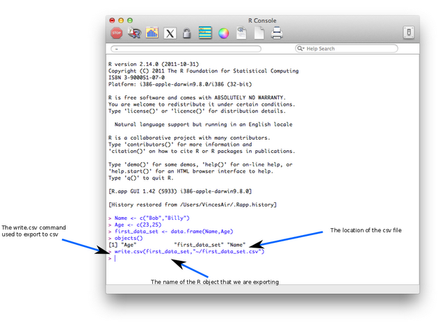

---

# Chapter 2 - Basic Statistical Procedures

---

## 2.1 Procedures

In the previous chapter we were introduced to some very basic aspects of
R:

1. what R looks like
2. how to import data into R
3. how to export data into R

In this chapter we will take a closer look at procedures that allow us to analyse and manipulate data. Vectors are the building blocks of all R objects. Single numeric/string variables are in fact vector of size 1. Almost all procedures in R are obtained by applying functions to vectors. Details as to how R handles these operations will be explained in the next chapter (so don't worry about it too much for now).

The procedures we are going to look at in this chapter are:

1. Viewing datasets
2. Summarising the contents of data sets
3. Obtaining summary statistics of data sets
4. Obtaining frequency tables
5. Obtaining linear models
6. Plotting data

## 2.2 A list of procedures

### Utility procedures

We have seen how to view and entire data set (by simply printing the name of the object in question).

We illustrate this once again by considering the MMM data set shown, (imported using read.csv).

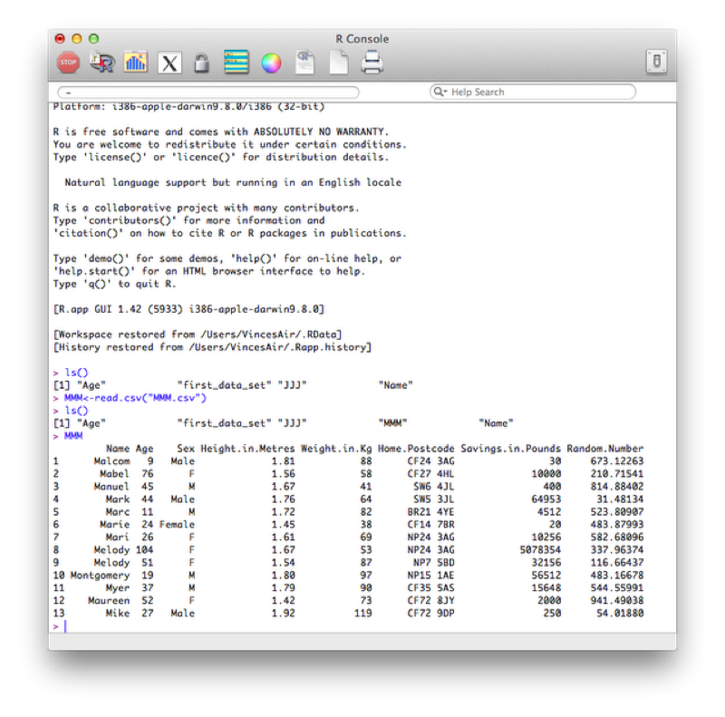

At times we might not want to open the data set but simply gain some information as to what is in the data set.

To view only the names of the variables of our data set we use the "name" function as shown.

    names(MMM)

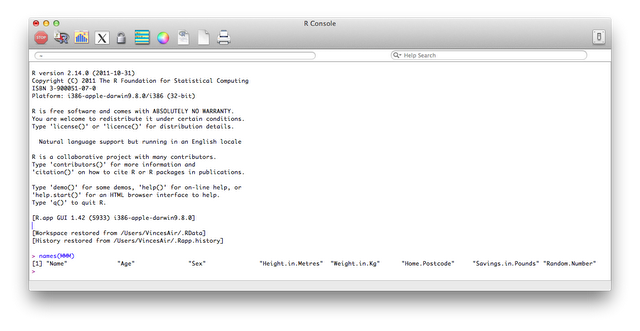

If we had a very large data set then we could quickly view the first/last few entries using the "head"/"tail" function as shown.

    head(MMM)
    tail(MMM)

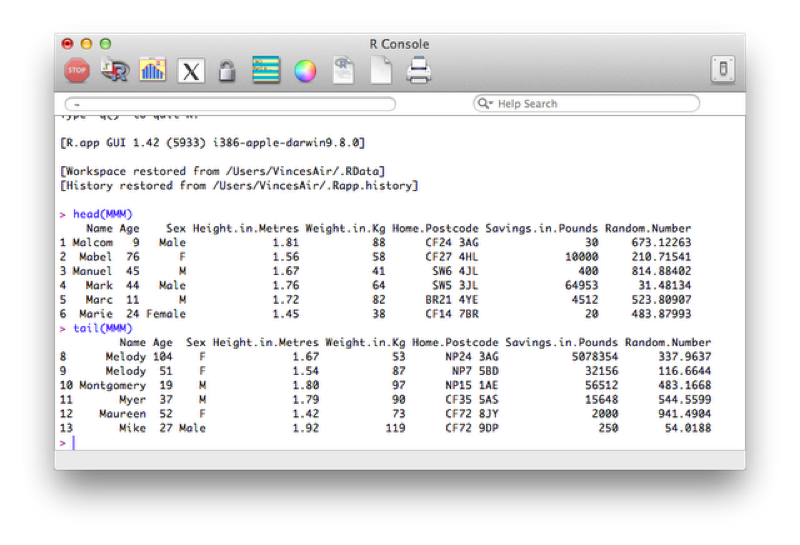

Finally if we would like to view a description of the overall structure of a data set we can use the "str" function as shown.

    str(MMM)

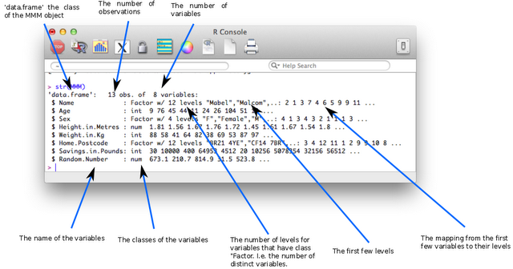

The class of the imported character variables are "Factors", this is due to the importation method (read.csv) automatically converting the character variables in this form - details about "Factors" are given below. The reason this occurs is the default value of stringsAsFactors (used in the read.csv function) is TRUE, the following code forces the characters retain their class without conversion.

    MMM<-read.csv("MMM.csv",stringsAsFactors=FALSE)

The factor stores the nominal values as a vector of integers in the range [ 1... k ] (where k is the number of unique values in the nominal variable), and an internal vector of character strings (the original values) mapped to these integers. This is often a much more efficient way of handling strings.

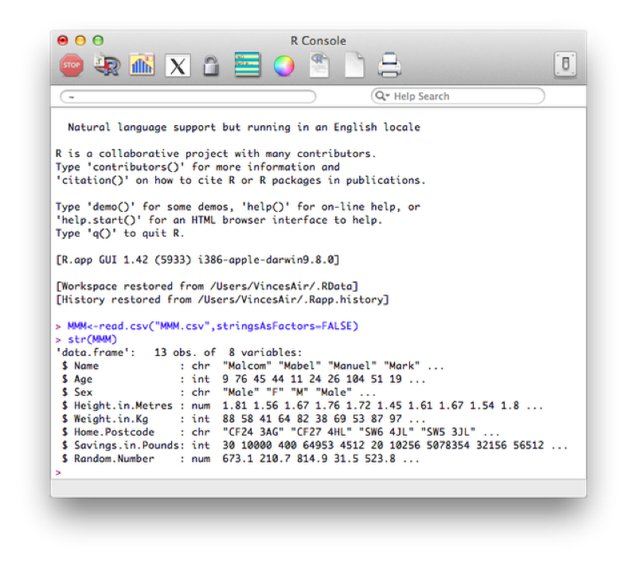

### Descriptive statistics

To gain an initial set of summary statistics of a data frame we can use the 'summary' function:

    summary(MMM)

The output of which is shown.

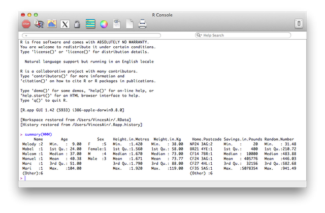

Recall that most "things" in R are objects and "summary" is a good example of a generic function that works on most objects. If you are faced with a new object (for example the output of a regression analysis) it is sometimes worth trying to apply summary on it to get some initial information.

To obtain a particular summary statistic of a specific variable, we can use functions that apply to vectors and select the vectors from the dataset.

To select a particular column (as a vector) from our dataset, we use the following command:

    MMM$Age

We can then apply various functions to this vector:

    length(MMM$Age)
    mean(MMM$Age)
    sd(MMM$Age)
    min(MMM$Age)
    max(MMM$Age)
    sum(MMM$Age)
    var(MMM$Age)

The output of which is shown.

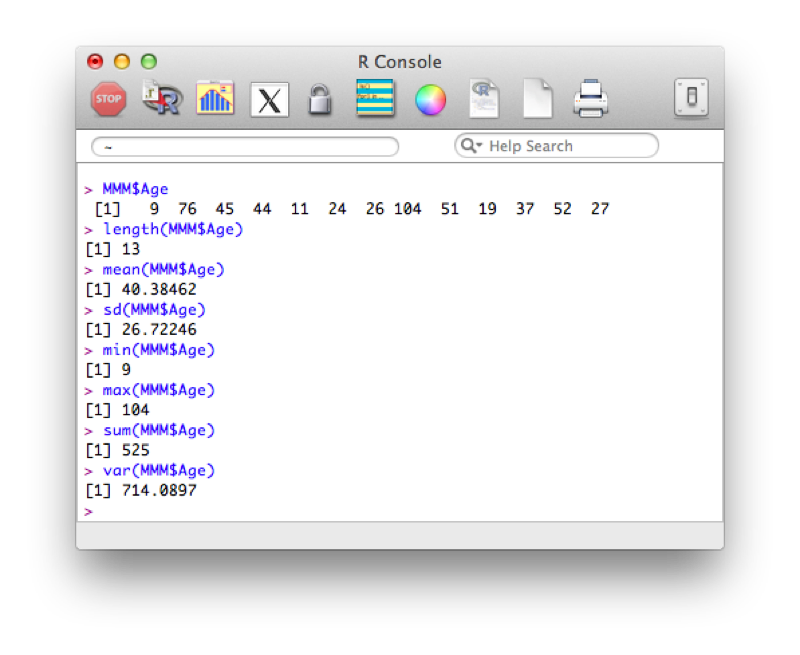

We can compartmentalise our results using the "by" function. The general syntax for the "by" function is given below:

    by(data=dataFrame , Indices=grouping variables, FUN= a function)

We'll use this to obtain the mean age and height compartmentalised by sex:

    by(MMM$Age, MMM$Sex, mean) by(MMM$Height.in.Metres, MMM$Sex, mean)

The output of which is shown.

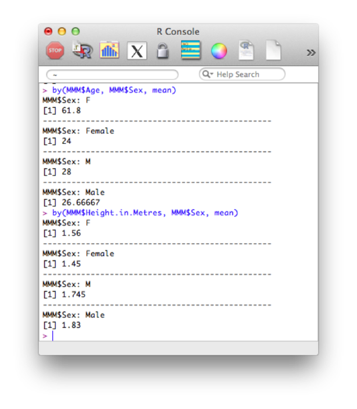

The above code subsets the data frame by the grouping variable. If we want to just carry out an action on a vector (as above, we're only actually interested in the Age vector or the Height vector) then we can also use the "tapply function". This applies a function to a vector according to the levels of another vector:

    tapply(MMM$Age, MMM$Sex, mean)

Finally, to reduce the number of keystrokes, we can use the "with" statement. This tells R to evaluate everything within a given data frame. The following code reproduces the above results:

    with(data=MMM,by(Age,Sex,mean) )
    with(data=MMM,tapply(Age, Sex, mean))

Note: the "data=" statement can be omitted.

### Frequency Tables

The "table" function allows us to obtain frequency tables of data sets.  As an example let us consider the data set shown. The "table" function creates a "table" (a particular type of R object):

    table(math_tests$Teacher,math_tests$Pass.Fail)

Again we can write this as:

    with(math_tests,table(Teacher,Pass.Fail))

We can save this table as a new object and use the 'prop' command to gain row and column totals and proportions:

    mytable<-table(math_tests$Teacher,math_tests$Pass.Fail)
    margin.table(mytable, 1)
    margin.table(mytable, 2)
    prop.table(mytable,1)
    prop.table(mytable,2)

The output of all this is shown.

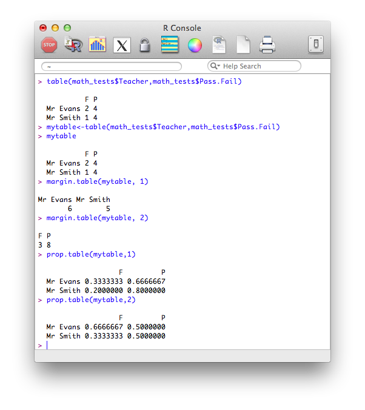

### Correlations

The following lines of code select only the columns from MMM that are numeric. An explanation of this will follow in the next chapter.

    MMM[,sapply(MMM,is.numeric)]

The correlation 'cor' function only acts upon numeric vectors (and/or dataframes), hence the selection of solely numeric values first.

    MMMnum<-MMM[,sapply(MMM,is.numeric)]
    cor(MMMnum)

The 'cor' function however does not give tests of significance. We can obtain significance tests between two variables using 'cor.test':

    cor.test(MMM$Age,MMM$Height.in.Metres)

The output is shown.

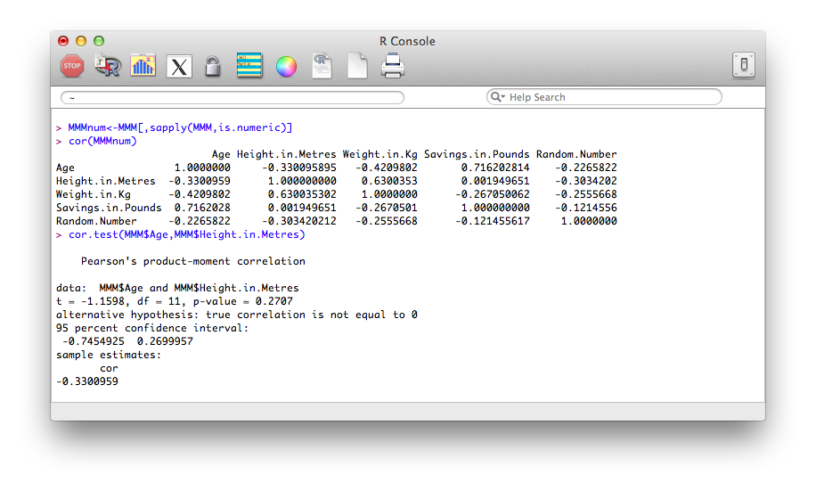

As is often the case in open source software, packages are independently developed and need to be called to be used in R. Above we have shown the very basic approach to obtaining correlations in R, we will now use the rcorr function from the Hmisc package.

To install the package we use the following code:

    install.packages("Hmisc")

Once that happens a window opens asking us to choose the mirror from which to download. This is shown.

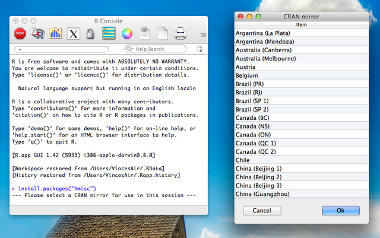

Once that is done to load the package the following code is required:

    library(Hmisc)

or:

    require(Hmisc)

To see the packages currently loaded we can use the following code:

    search()

Note: Packages can also be installed by selecting the 'Packages' tab and selecting the package required for installation.

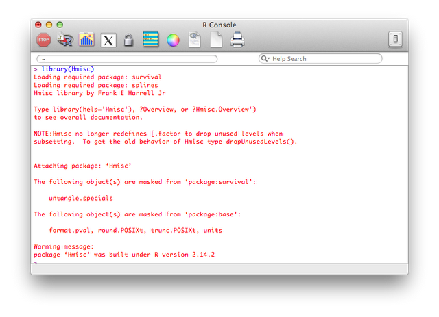

Using this package, we will use the 'rcorr' function that gives the correlation matrix for a data set. Note that the data set must be numeric and in 'matrix' form. The following code selects the numeric variables from the MMM data set and converts the result to a matrix:

    MMMnum<-MMM[,sapply(MMM,is.numeric)]
    MMMmat<-as.matrix(MMMnum)

Once this is done we can get the correlation matrix using the following code:

    rcorr(MMMmat)

The output is shown.

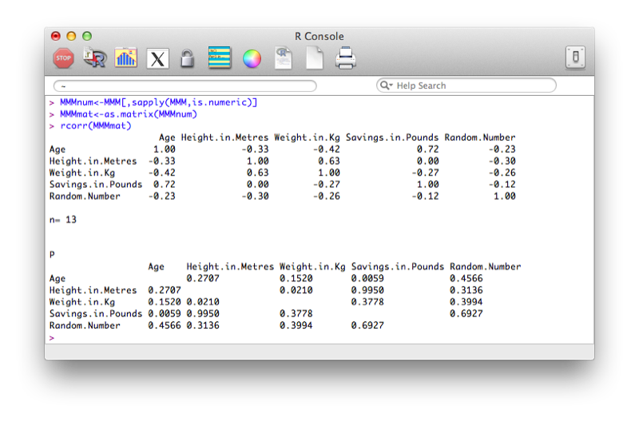

### Linear Models

In this section we very briefly see the syntax for some basic linear models in R.

The general syntax for linear regression is as follows in R:

    lm(outcome~predictors)

The following code will be used to investigate whether or not there is a linear model of height with weight and savings and predictors (in two ways, the second is slightly more compact and leaves less room for confusion):

    lm(JJJ$Height.in.Metres~JJJ$Weight.in.Kg+JJJ$Savings.in.Pounds)
    lm(Height.in.Metres~Weight.in.Kg+Savings.in.Pounds,data=JJJ)

The results are shown.

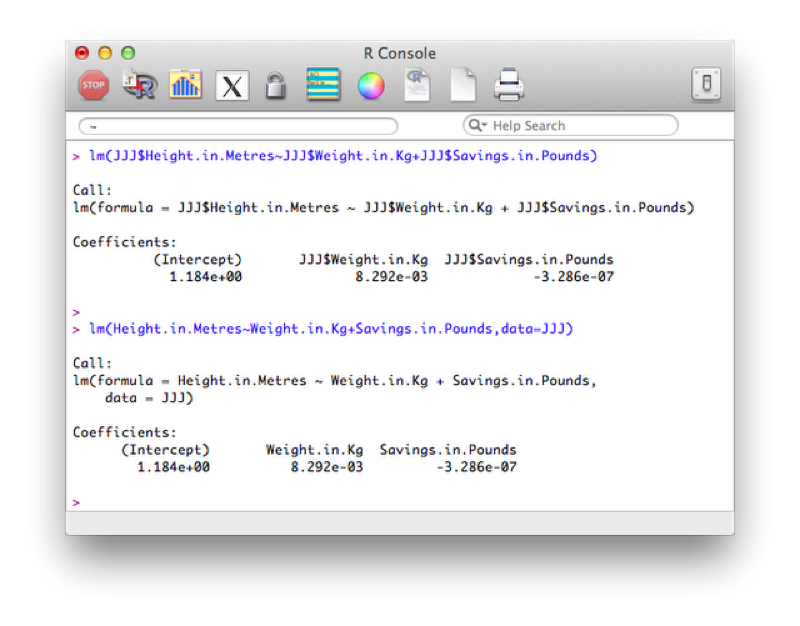

To get the full set of results from the regression analysis we use the following code:

    summary(lm(Height.in.Metres~Weight.in.Kg+Savings.in.Pounds,data=JJJ))

The output is shown.

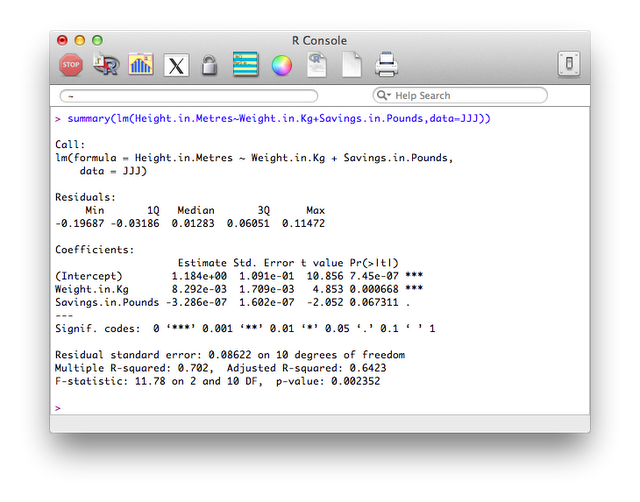

Looking at the p value we see that the overall model should not be rejected, however the detailed results show that perhaps we could remove savings from the model.

Analysis of variance (ANOVA) can be done easily in R. We shall show this using a new data set (math.csv) shown.

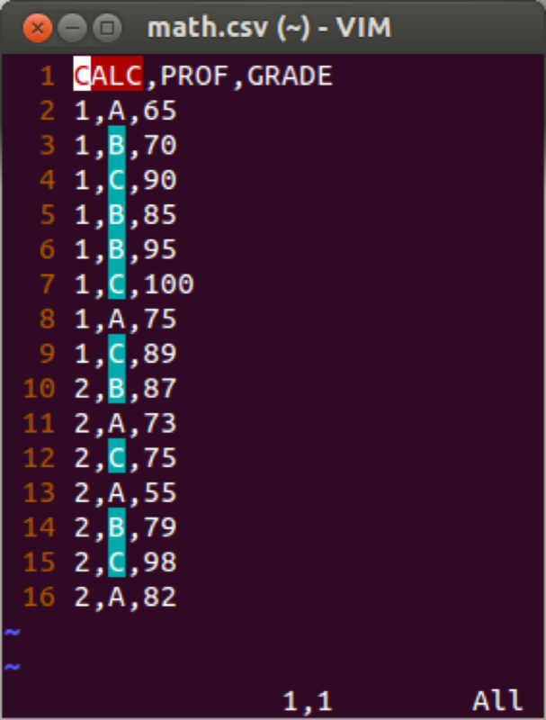

    aov(outcome~class,data)

We will use the "aov" function to see if the grades obtained by students depend on their teacher (in two ways, the second is slightly more compact):

    aov(math$GRADE~math$PROF)
    aov(GRADE~PROF,data=math)

The results are shown.

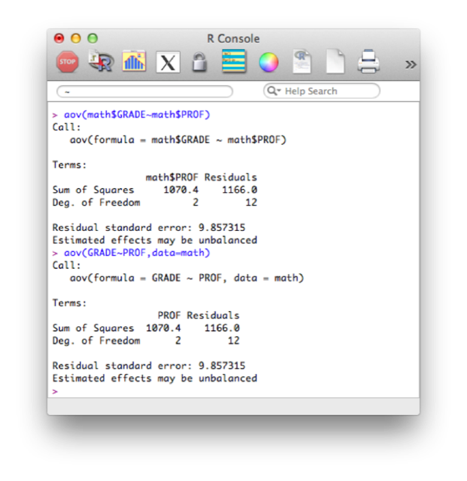

To get the full set of results from the ANOVA we use the following code:

    summary(aov(GRADE~PROF,data=math))

The results are shown.

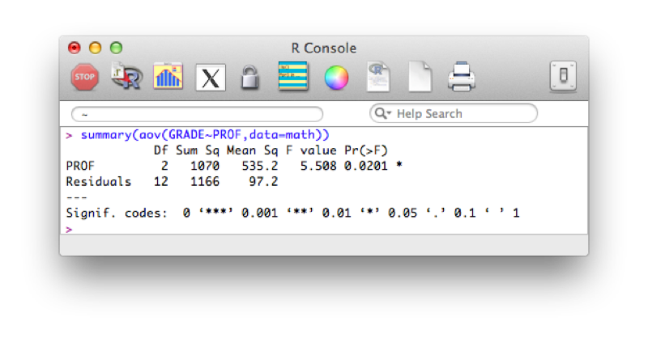

### Plots and charts

Note that due to the object oriented nature of  R, almost all of the above outputs have a "plot" attribute.

The simplest way to produce a histogram in R is to use the "hist" function. The following code gives a histogram for the height of entries in the JJJ data set as shown.

    hist(JJJ$Height.in.Metres)

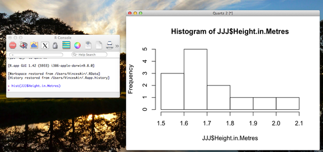

The simplest way to produce a scatter plot in R is to use the "plot" function. The following code gives a scatter plot for the height against weight of entries in the JJJ data set as shown.

    plot(JJJ$Weight.in.Kg,JJJ$Height.in.Metres)

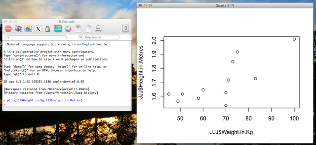

There are various other ways to obtain similar graphs, as well as change the look and feel of our graphs. We won't go into this here but you are encouraged to look into it (in particular the ggplot package is widely used).

2.3 Exporting output

All the non graphical outputs from R are objects, as such they can be output to a file (to be copied into another document if need be) using the write statements of Sections 1.4. However to export graphical output, we use any of the following statements (depending on the output format required):

    pdf("mygraph.pdf")
    win.metafile("mygraph.wmf")
    png("mygraph.png")
    jpeg("mygraph.jpg")
    bmp("mygraph.bmp")
    postscript("mygraph.ps")

Once that command is written we use a normal R command to create a plot and finally we close the output file with the following statement:

    dev.off( )

The following code creates a png file entitled "height_v_weight_plot" with the previous scatter plot.

    png("height_v_weight_plot.png")
    plot(JJJ$Weight.in.Kg,JJJ$Height.in.Metres)
    dev.off( )

---

# Chapter 3 - Manipulating data

---

## 3.1 Vectors and data frames

### Vectors

When considering R data frames it is important to recall that they are composed of vectors. Even individual scalars and strings are vectors. This is a very powerful tool.

One important notion when handling vectors is the use of 'recycling'. As all elements are vectors, when performing an operation between two vectors of different length, R automatically repeats (or recycles) the shorter one until it is long enough.

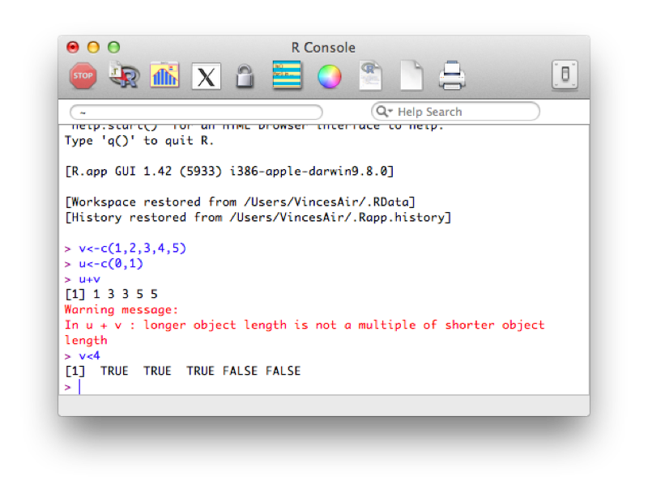

In the previous example, ("u+v") we add the elements of both vectors together. R automatically increases the length of "u" so that the operation becomes (1,2,3,4,5) + (0,1,0,1,0). In the second example we compare the elements of "v" to 4. R automatically increases the length of the vector containing 4 so that the operation becomes (1,2,3,4,5)<(4,4,4,4,4) which returns a vector of size 5 with boolean (True or False) elements.

This second concept is important when understanding how to select certain variables in R (we saw this briefly in the previous section).

Another important notion in R is that of indexing. We can select elements of a vector by specifying the indices of the elements required:

    dwarfs<-c("Dopey","Sneezey","Happy","Sleepy","Grumpy","Bashful","Doc")
    dwarfs[c(1,4,5)]
    dwarfs[3:length(dwarfs)]

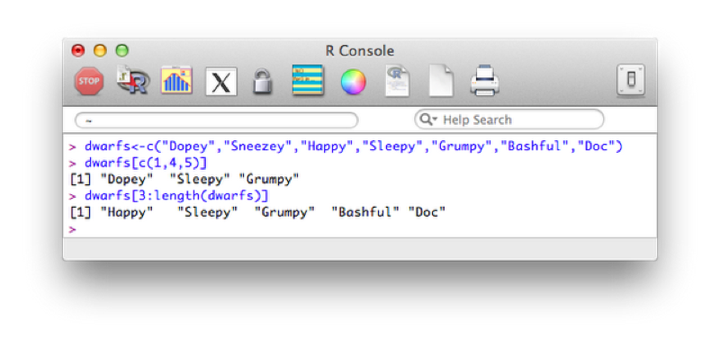

Both of the previous approaches use a vector of indices to indicate the elements we require. The second approach uses a shorthand to create a vector of elements (containing the integers 3 to 5). Another approach is to simply use a vector of boolean values (True or False) to indicate the positions that are to be selected.

    Index<-c(TRUE,FALSE,FALSE,FALSE,FALSE,FALSE,TRUE)
    dwarfs[Index]

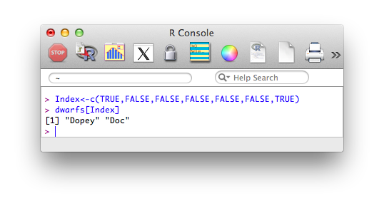

It should be straightforward to realise that we can combine recycling and indexing to filter vectors:

    Index<-substr(dwarfs,1,1)=="D"
    dwarfs[Index]

The first command creates an index set of boolean variables using the "substr" function and recycling (in this case used to take the first character of each element). This allows us to obtain the elements of the vector dwarfs with first letter "D" as shown.

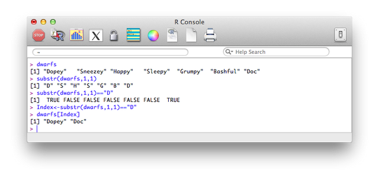

We have seen how to subset vectors using filtering, the same logic applies to data frames.

We can first of all use indexing to obtain the variables we want. For example the following code will select the all the variables apart from the 4th and 5th:

    MMM[c(1,2,3,6,7,8)]

A quicker way is to simply state the variables we want to drop:

    MMM[c(-4,-5)]

The output of the above code is shown.

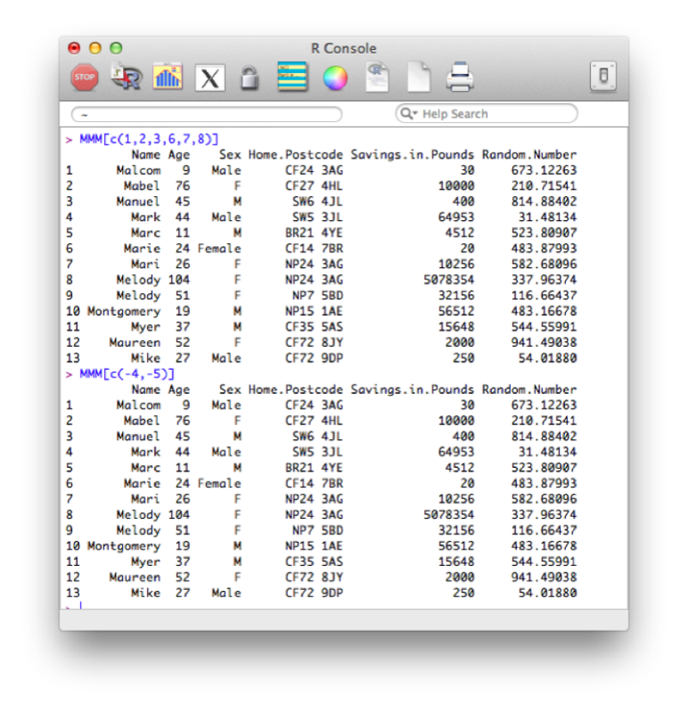

We can also list the names of variables we want to keep:

    MMM[c("Name","Age","Sex","Home.Postcode","Savings.in.Pounds","Random.Number")]

Finally we can create a vector of booleans that gives the same above result or the opposite result (i.e. drops the variables).

    Index<-names(MMM) %in% c("Weight.in.Kg","Height.in.Metres")
    MMM[Index]

    Index<-names(MMM) %in% c("Weight.in.Kg","Height.in.Metres")
    MMM[!Index]

Recall the "names" function simply gives a vector containing the names of all the variables in the MMM dataset. The "%in%" operator is used to create a vector of booleans by testing if the elements of names(MMM) are 'in' the vector c("Weight.in.Kg","Height.in.Metres"). The "!" operator acting on "Index" simply negates the booleans contained in Index.

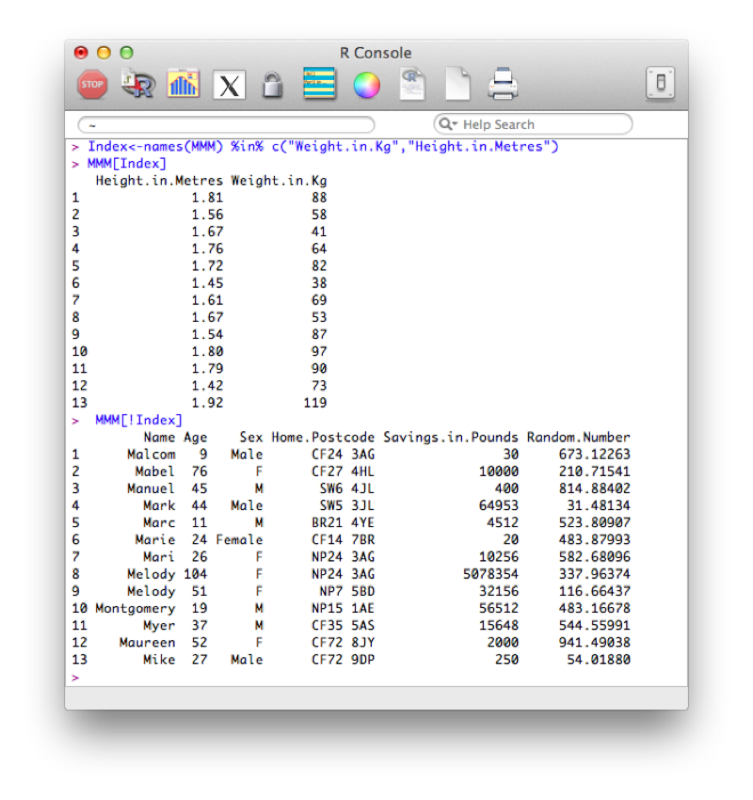

### Selecting Observations

We can select any particular element of a data frame in R using the following syntax:

    dataframe[i,j]

This would give the entry for variable j of observation i as shown.

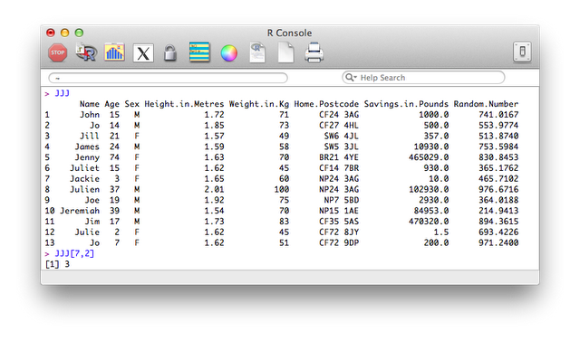

If we ignore one of the indices R simply returns all the entries corresponding to that index. For example the following code would return all the observations for the 7th observation of the JJJ data set:

    JJJ[7,]

We can also use this to sort a data set. The "order function" returns a set of indices reflecting the ascending order of a vector, thus to sort the JJJ data set by age we use the following code:

    JJJ[order(JJJ$Age),]

We can use filtering to expand on this and select all observations that obey a particular condition. For example the following code selects entries of JJJ that have age less than or equal to 18:

    JJJ[JJJ$Age<=18,]

## 3.2 Merging and concatenating data sets

To concatenate two data sets in R we use the rbind function (i.e. we bind the two dataframes by rows).

    MMMJJJ<-rbind(JJJ,MMM)

Note that both these data sets need to contain all the variables. If one of the datasets does not contain all the variables then you need to add that variable to it and set its values to NA (missing).

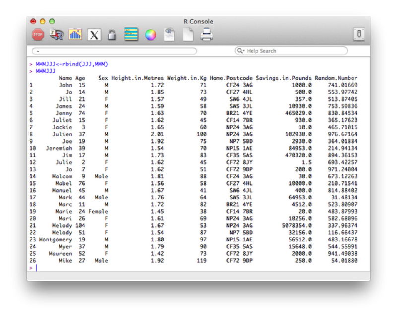

To merge two dataframes in R we use the merge function. We'll illustrate
this with the following data set:

    Name<-c("Bob","Ben")
    Weight<-c(75,94)
    other_data_set<-data.frame(Name,Weight)

We'll merge this new data set with the data set we created in Chapter 1.

    merged_data_set<-merge(first_data_set,other_data_set,"Name")

(or equivalently:)

    merged_data_set<-merge(x=first_data_set,y=other_data_set,by="Name")

The output is shown.

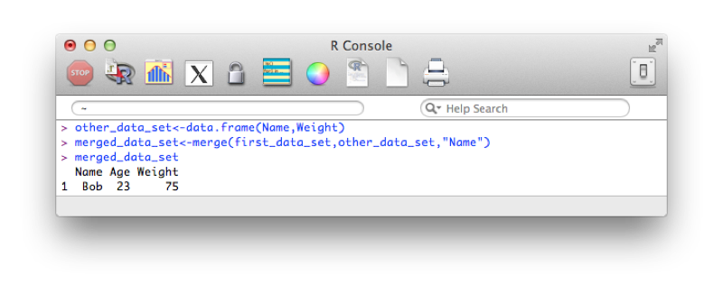

Note that the merge statement only selects observations that are present in both files. We can pass further arguments to the merge statement that allow us to select all the values from a particular data set and/or both data sets. These operations are at times called 'joins' (and are very common in SQL which we shall see in Chapter 5). The basic merge statement (as above) would be referred to as an 'inner' join.

A left outer join (selecting all variables from the first data set):

    merged_data_set<-merge(first_data_set,other_data_set,"Name",all.x=TRUE)

A right outer join:

    merged_data_set<-merge(first_data_set,other_data_set,"Name",all.y=TRUE)

A full outer join:

    merged_data_set<-merge(first_data_set,other_data_set,"Name",all=TRUE)

The output of the above is shown.

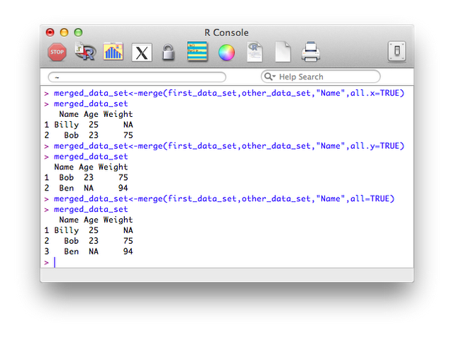

## 3.3 Creating new variables

Creating new variables using various arithmetic and/or string relationships is straightforward in R. The following code creates a new data set call MMM_with_BMI as a copy of the MMM data set and then adds a new variable "BMI" as a function of the height and weight variables in the MMM_with_BMI dataset.

    MMM_With_BMI<-MMM
    MMM_With_BMI$BMI<-MMM$Weight.in.Kg/(MMM$Height.in.Metres^2)
    MMM_With_BMI

The output is shown.

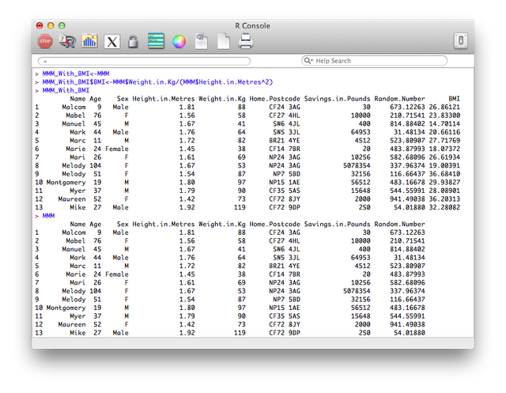

The above code is quite long though, so we can use the "within" function which is similar to the "with" function. It lets R know you are working within a particular data frame.

    MMM_With_BMI <- within(MMM, BMI <- Weight.in.Kg/(Height.in.Metres^2))

The output is shown:

Some of the arithmetic functions available in R are shown in Figures 3.13 and 3.14.

Symbol

Definition

Example

** or ^

Exponential

y=x**3 or y=x^3

*

Multiplication

r=x*y

/

Division

d=x/y

+

Addition

s=x+y

-

Subtraction

t=x-y

Figure 3.13 Basic arithmetic operations in R

Symbol

Definition

Example

abs

Absolute value

y=abs(x)

floor

Integer (takes the integer part of the argument)

y=floor(x)

log

Natural Log

y=log(x)

log10

Log base 10

y=log10(x)

round

Rounds the argument to the nearest specified level

y=round(x,2)

sqrt

Square root

t=sqrt(x)

Figure 3.14 Some mathematical functions in R

We can also do operations on strings, the following code replaces the
variable "Sex" with the first character of "Sex" (which gets rid of the
Male - M and Female - F issue).

    MMM_With_BMI$Sex<-substr(MMM_With_BMI$Sex,1,1)

Some examples of string functions are shown in Figure 3.15.

Symbol

Definition

Example

substr

Outputs a substring of length L starting at position N of a string.

y=substr(string,N,L)

toupper

converts a string to upper case

y=toupper(string)

tolower

converts a string to lower case

y=tolower(string)

Figure 3.15 Some string functions in R

It's also worth checking the web for other R functions (there is a huge amount of them).

### Renaming variables

To rename variables one can use the "rename" function from the "reshape" library (that can be installed as we have seen in previous section).

    library(reshape)
    JJJ<-rename(JJJ,c(Sex="Gender"))

The output is shown.

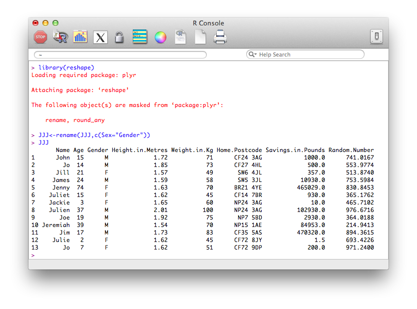

Another option is to use the "fix" function that opens the dataset in a GUI that easily allows for modification of the dataset (including the name of the variables). Note that changes are saved on close of the fix environment.

    fix(JJJ)

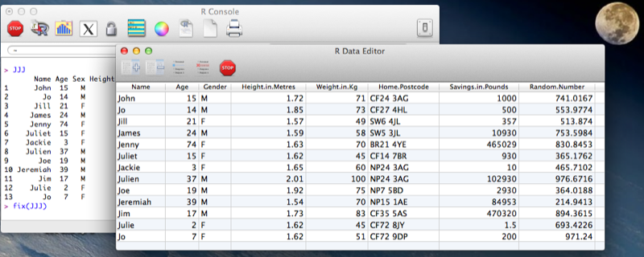

Operations across rows

As discussed previously, the columns of a data frame can be manipulated very easily as they are just vectors. In the next section we will see how to manipulate vectors using flow control statements but we will take a quick look at two functions that allow for quick and easy manipulation across rows.

We will demonstrate this using the birthday_money.csv data set as shown.

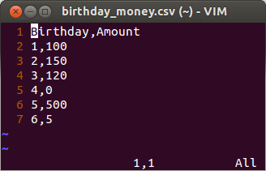

Suppose we want to take a cumulative sum of the birthday money, we create a new variable call total using the "cumsum" function that returns the the cumulative sum of elements of a vector.

    birthday_money$total<-cumsum(birthday_money$Amount)

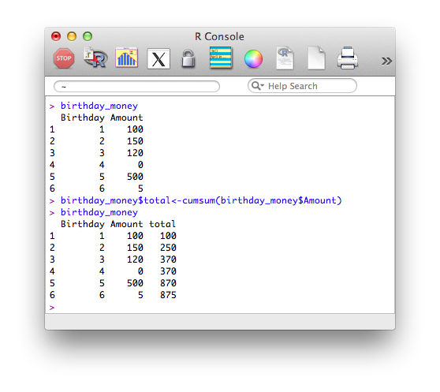

Another similar tool is to use the "diff" function that calculates consecutive differences of elements of a vector:

    birthday_money$yearly_diff<-c(NA,diff(birthday_money$Amount))

Note that we also include a first entry of our column "yearly_diff" as "NA", this is because the output of diff will be shorter than the length of the original vector.

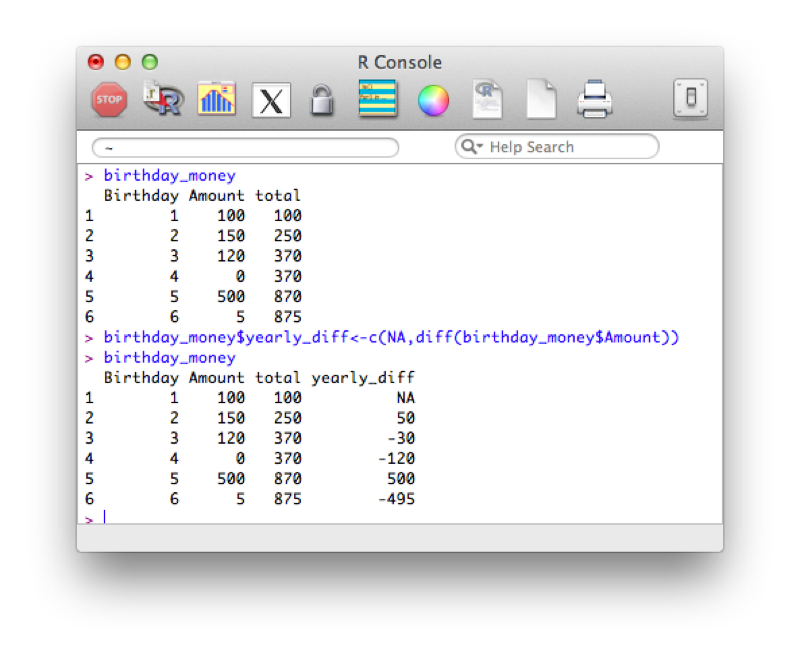

## 3.4 Handling dates in R

Dates are a particular class in R. When importing dates, they are imported as strings.

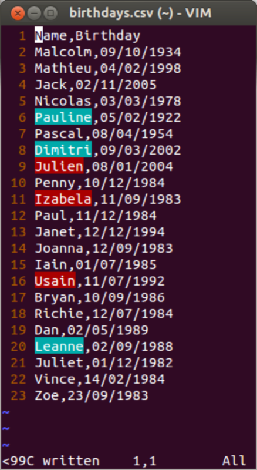

We import the file and create a data frame in the usual way:

    birthdays<-read.csv("~/birthdays.csv")

Using the "str" command to view the structure of our data frame:

    str(birthdays)

The output is shown confirming that the dates are recognized as strings (recall that by default "read.csv" imports strings as "factors").

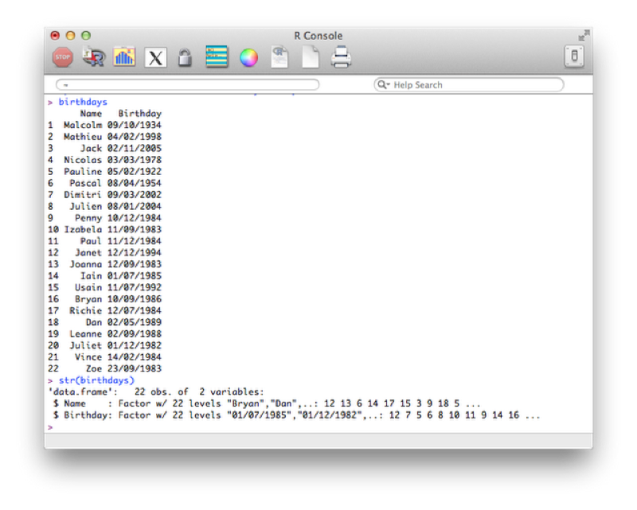

In this current format if we tried to carry out any mathematical manipulation of the dates we would not succeed. We can however tell R that certain variables are dates. We do this using the "as.dates" function by describing the format our dates are in:

    birthdays$Birthday<-as.Date(birthdays$Birthday,"%d/%m/%Y")

The format is indicated using "%x" where "x" is any of the following:

Symbol

Meaning

Example

d

Day as a number

01-31

a

Abbreviated weekday

Mon

A

Weekday

Monday

m

Month

01-12

b

Abbreviated month

Jan

B

Month

January

y

2 digit year

84

Y

4 digit year

1984

We'll now check the structure of our data frame, re-order (using the "order" function - that returns the indices of the elements of a vector in order) our birthdays and calculate the difference between birthdays (using the "diff" function).

    str(birthdays$Birthday)
    order(birthdays$Birthday)
    sorted<- birthdays[order(birthdays$Birthday),]
    diff(birthdays$Birthday[order(birthdays$Birthday)])

The output of all this is shown.

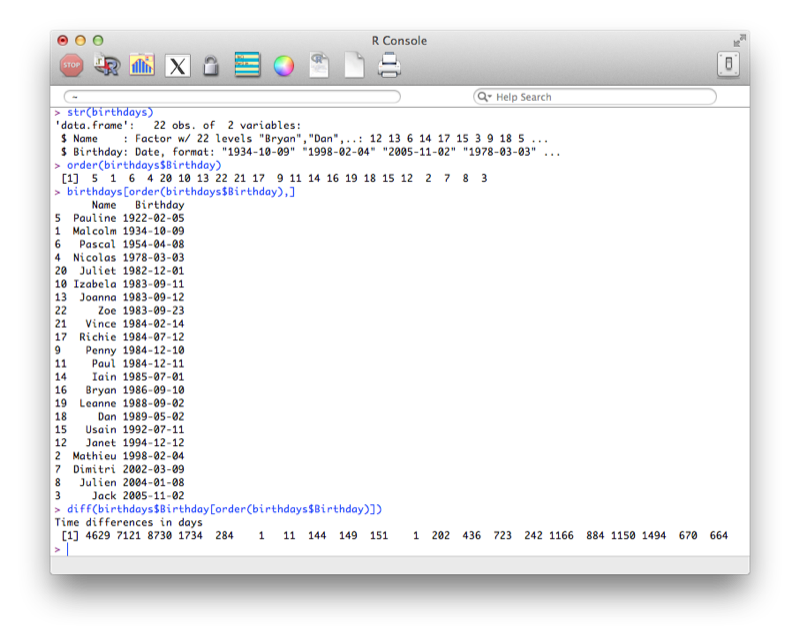

---

# Chapter 4 Programming

---

## 4.1 Flow Control

A huge part of programming (in any language) is the use of so called "conditional statements" that allow for flow control. We do this in R using "if" statements.

There are two types of "if" statements in R. The simple "if" statement as shown below:

    x<-39
    if (x>20) y<-1

We can use this in conjunction with an "else" statement:

    x<-19
    if (x>20) y<-1 else y<-0

Finally, the if-else call is a function and as such we can rewrite the above code as:

    y<- if (x>20) 1 else 0

Finally we can include multiple commands as outcomes of an if statement by using "{}":

    x<-20
    if (x==21) {
    y<-1
    z<-"T"
    } else{
    y<-0
    z<-"F"}

The above statements checks a single value and whilst we'll learn in the next section how to loop offer sets of values it is very much worth learning how to use the 'vectorized' form of the if statement: the "ifelse" command. The general syntax is given below:

    ifelse(Boolean_Vector,Outcome_If_True,Outcome_If_False)

An example of this is given below:

    ifelse(c("True","False","True","False"),"Young","Old")

The output is shown.

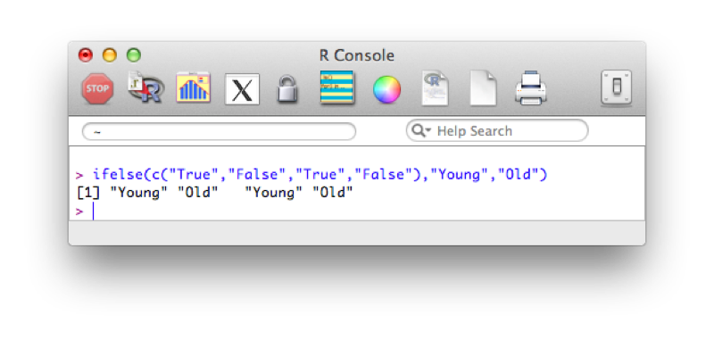

Using this and our knowledge of filtering we see how we can create new variables using the ifelse statement. The following code creates a new variable "age_group":

    MMMJJJ$Age_group<-ifelse(MMM$Age<30,"Young","Old")
    MMMJJJ[c("Name","Age_group")]

The output is shown.

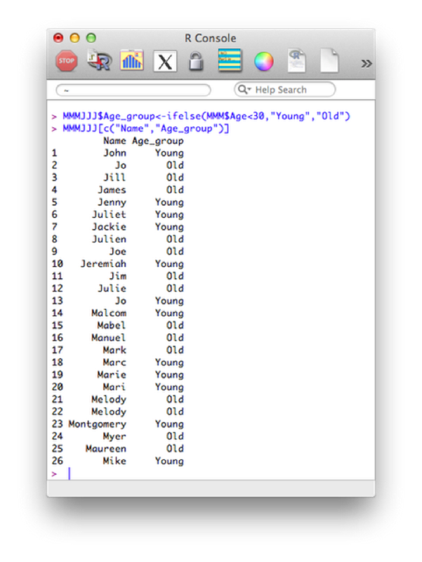

Figure 4.3 shows some of the comparison operators that can be used in conjunction with 'if' statements.

Symbol

Mnemonic

Definition

<

Lt

Less than

<=

Le

Less than or equal to

>

Gt

Greater than

>=

Ge

Greater than or equal to

==

Eq

Logical Equal to

!=

Ne

Not equal to

Figure 4.3 R Comparison Operators.

A further important notion in programming is the notion of loops. There are two types of loops that we will consider:

1.  for
2.  while

The for loop allows us to compute iterative procedures. As with most things in R, the for loop iterates a value over a vector. The following code outputs the total number of birthday candles that would have been used on everyones birthday cake in the JJJ data set.

    Candles=c()
    for (Age in JJJ$Age){
    c<-0
    for (n in 0:Age){
    c<-c+n
    }
    Candles<-c(Candles,c)
    }
    Candles<-data.frame(Name=JJJ$Name,Age=JJJ$Age,Candles)

The first statement creates an empty vector called "Candles". The first for loop, loops over the age variable in the JJJ data set ("0:age" is in fact a short way of writing a vector of integers from 0 to age). For each of those values of age we use a second for loop to sum the total number of candles and concatenate that value to the vector Candles. Finally we create a new data set Candles by concatenating the various vectors required (note that we're also renaming certain variables here).

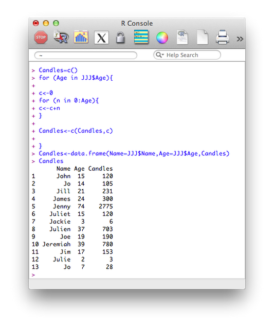

Note that in general this is not the most efficient way of undertaking things in R. Vectorized versions of the above are much faster (we won't cover these here). Another improvement for the above code is to create the vector Candles initially as a vector of the correct size and type. For example we can create a numeric vector of a certain length using the following code (all initial values will be set to 0):

    Candles=vector("numeric",length=length(JJJ$Age))

Using this the above code would be written as:

    Candles=vector("numeric",length=length(JJJ$Age))
    k<-0
    for (Age in JJJ$Age){
    k<-k+1
    c<-0
    for (n in 0:Age){
    c<-c+n
    }
    Candles[k]<-c
    }
    Candles<-data.frame(Name=JJJ$Name,Age=JJJ$Age,Candles)

The second type of loop we will consider is the do while loop. This loop checks a condition before carrying out an operation. The following code creates a vector with all even numbers less than 70:

    k<-0
    even<-2*k
    even_numbers<-c(even)
    while(even<70){
    k<-k+1
    even<-2*k;
    even_numbers<-c(even_numbers,even)
    }

The output is shown.

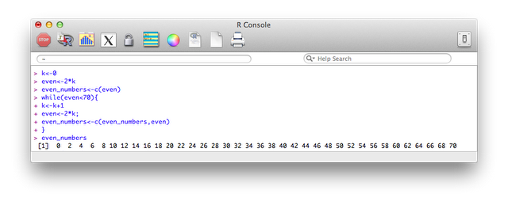

## 4.2 Functions

One of the great capacities of R is the ease with which one can create new functions. The general syntax for this is given by:

    myfunction <- function(arg1, arg2, ... ){
    statements
    return(object)
    }

The return statement is very important as it indicates the "result" of the function. This can be any R object, a vector, a data frame etc...  Note that is can also be omitted, as long as the last command is what you want returned.

The following code creates a function called "f1" that adds 3 to a number if it is even and adds 2 to a number if it is odd.

    f1 <- function(x){
    r <- if (x%%2==0) x+3 else x+2
    return(r)
    }

To run the function we would then use it like any other R function. For example the following would return 11.

    f1(9)

(The %% command return the modulo of the first number with respect to the second)

We can also create a function with no arguments that simply replicates shorthand for some code:

    My_plot <- function(){
    r<-hist(JJJ$Height.in.Metres)
    return(r)
    }

    My_plot()

The following code defines a function that creates a new dataset entitled "JJJ_after_shopping" that subtracts a quantity from the savings variable in the JJJ dataset:

    shopping <- function(spend){
    New.Savings<-JJJ$Savings.in.Pounds-spend
    JJJ_after_shopping<-data.frame(JJJ$Name,Old.Savings=JJJ$Savings.in.Pounds,New.Savings)
    return(JJJ_after_shopping)
    }

Note that this function makes use of recycling (when creating the New.Savings vector).

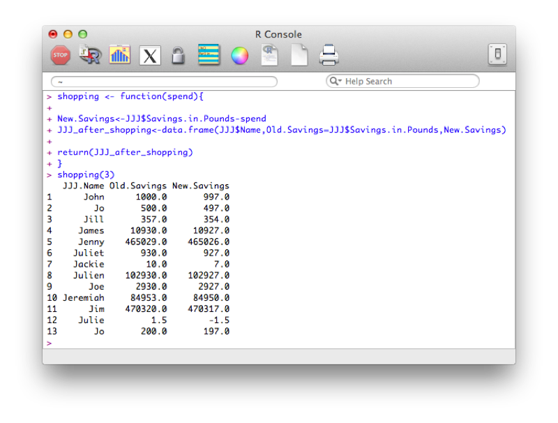

We can of course define functions with multiple arguments as below:

    shopping <- function(spend,trips){
    New.Savings<-JJJ$Savings.in.Pounds-trips*spend
    JJJ_after_shopping<-data.frame(JJJ$Name,Old.Savings=JJJ$Savings.in.Pounds,New.Savings)
    return(JJJ_after_shopping)
    }

It's also possible to set certain values as defaults:

    shopping <- function(spend,trips=1){
    New.Savings<-JJJ$Savings.in.Pounds-trips*spend
    JJJ_after_shopping<-data.frame(JJJ$Name,Old.Savings=JJJ$Savings.in.Pounds,New.Savings)
    return(JJJ_after_shopping)
    }

## 4.4 Vectorising

In general the for loops we have seen can be written in a much more efficient way using function and various forms of the apply function (which apply functions over vectors, lists and matrices):

1. apply
2. lapply
3. sapply
4. mapply

Note that an array in R is a very generic data type; it is a general structure of up to eight dimensions. For specific dimensions there are special names for the structures. A zero dimensional array is a scalar or a point; a one dimensional array is a vector; and a two dimensional array is a matrix. The general syntax of the apply function is given below:

    apply(matrix,margin,function)

We have not yet seen matrices but they are relatively simple to understand: 2 dimensional objects. The following code produces a 2 by 3 matrix:

    mat<-matrix(c(1,2,3,4,5,6),2,3)
    mat

The "margin" option (either 1,2 or both (1:2)) simply tells R what dimension to apply the required function to, experiment with the following:

    apply(mat,1,mean)
    apply(mat,2,mean)
    apply(mat,1:2,mean)

We can use the apply function on data frames and vectors but in general it will be easier to use the "lapply" function which simply applies a function to a 1 dimensional object. The lapply function becomes especially useful when dealing with data frames. In R the data frame is considered a list and the variables in the data frame are the elements of the list. We can therefore apply a function to all the variables in a data frame by using the lapply function. Note that unlike in the apply function there is no margin argument since we are just applying the function to each component of the list. The following code simply returns the sqaure roots of a vector.

    lapply(c(1,2,3,4,5),sqrt)

Note that the above returns a list (an R object that we will not pay much attention to here). We can get a vector by using the following:

    unlist(lapply(c(1,2,3,4,5),sqrt))

The "sapply" function is simply a version of lapply that by default returns the most appropriate object type. The following code gives the exact same result as above:

    sapply(c(1,2,3,4,5),sqrt)

Finally, there exists a multivariate example of the above function which allows us to pass multiple arguments to a function. The following code defines a simple function:

    simple_function<-function(x,y) x/y

We can now apply this function so that it takes the consecutive ratios of two vectors:

    mapply(simple_function,1:4,4:1)

With these functions we can drastically improve the performance of R code. The following reproduces code from before:

    my_sum<-function(x){
    sum(x)
    }

    sapply(JJJ$Age,my_sum(1:x))

Note that there is no need to actually define the function we can refer directly to the function object:

    sapply(JJJ$Age,function(x) sum(1:x))

## 4.5 Handling strings

SAS is a macro language and philosophically macros allow a user to substitute pieces of text for a variable, and evaluate the result. R is not a macro language and thus does the opposite: evaluates the arguments and then uses the values.

The paste command allows us to concatenate strings. The following code outputs the string "Hello-World". Note that we can use any string as a separator (include the empty string "").

    x<-"Hello"
    paste(x,"World",sep="-")

This immediately allows for quite complex manipulation of data files. For example the following code, imports the 5 datafiles File_1.csv - File_5.csv:

    f<-function(i){read.csv(paste("File_",i,".csv",sep=""))}
    dat<-lapply(1:5,f)

Note that this piece of code introduces a new structure a bit more formally. The object "dat" is here a list and we use the "lappy" function (we haven't seen this yet) to apply the newly created function "f" (that imports data).

The output is shown.

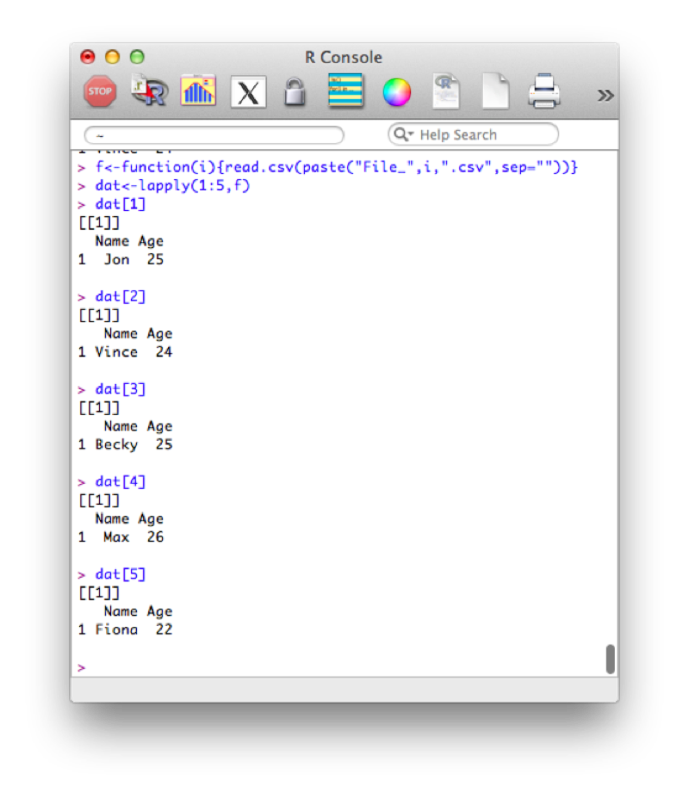

We can also revisit a previous function (the shopping function) and create a different data set for every value of spend. We'll even make this a bit more complicated and nest functions so that we can repeat this operation for various values of the variable "spend".

    shopping <- function(spend,trips=1){
    New.Savings<-JJJ$Savings.in.Pounds-trips*spend
    infile<-paste("JJJ_after_shopping_",trips,sep="")
    data_frame<-data.frame(JJJ$Name,Old.Savings=JJJ$Savings.in.Pounds,New.Savings)
    assign(infile,data_frame,envir=.GlobalEnv)
    }

    multiple_shopping<- function(spend,max_trips=10){

    for (i in 1:max_trips){
    shopping(spend,i)
    }
    }

Note the extra option that has been passed to the "assign" command "envir=.GlobalEnv". This is to ensure that the data sets created in the function are global (i.e. are still there when the function stops running).

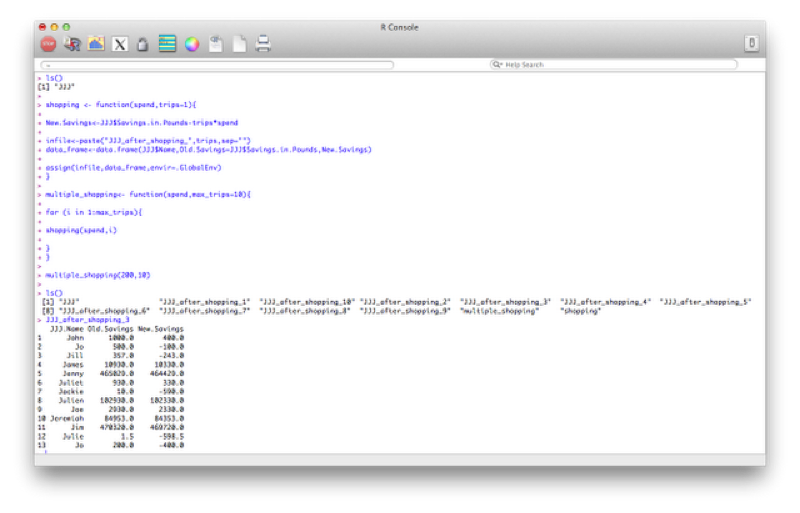

4.4 Memory and scripts.

In this section we will take a brief look at how R handles the "workspace". If you have already quit R you would have seen the prompt "Save workspace image?". If you answer "yes" then R saves various things to various files (in the current working directory): 1.  .Rdata holds all the objects (data frames, vectors, functions etc...) currently in memory (note that this file is written in an R specific file and so can't be read).  2.  .Rhistory holds all the commands used (and so can be recalled).

Being prompted whether or not to save the workspace is helpful (in my opinion) as you can simply open an R session to try a few things and not save (similar to using the work library in SAS). It is possible to save the workspace image as you go (this is worthwhile in case your system happens to crash):

    save.image()

Note: we can leave the argument of the "image" function empty (as above), in which case the file will be saved in the current directory.  We can also pass the required location to the "image" function.

It is also possible to save particular objects to particular files as well as load files but we won't go into that here.

One final aspect to consider is that of running script files from the command line. We do this using the "source" command. Note that this command executes all the code in the script as if it was typed in one after the other. To see this let us write the following code in a text file (saving it as "first_script.r" on the desktop for example):

    x<-c(1,2,3,4)
    y<-c(1,0)
    print(x+y)
    print(x*y)

We then run the script using the following code:

    source("~/Desktop/first_script.r")

Repetitive command that are run often (for example, routine data analysis) can be saved as scripts and called if and when new data is received.

# Chapter 5 Packages

In this chapter we will examine three packages in particular:

1. sqldf: a package allowing for the use of sql syntax in R
2. ggplot2: a powerful package for the plotting of data
3. twitteR: a package that allows for the data mining of twitter

## 5.1 sqldf

SQL is a language designed for querying and modifying databases. Used by a variety of database management software suites:

1.  Oracle
2.  Microsoft ACCESS
3.  SPSS

SQL uses one or more objects called TABLES where: rows contain records (observations) and columns contain variables.

To use SQL in R we need to use the sqldf package.

The following code creates a data set called test in the work library as a copy of the mmm data set:

    test<-sqldf("select * from MMM")

The "*" command tells R to take all variables from the data set. We can however specify exactly what variables we want:

    test<-sqldf("select Name,Age,Sex from MMM")

We can also create new variables:

    test<-sqldf("select Name,Age,Sex,Weight_in_Kg/(power(Height_in_Metres,2)) as bmi from MMM")

The following table gives some of the SQL operators:

abs()

Gives the absolute value

ceil()

Gives the ceiling

floor()

Gives the floor

exp()

Gives the exponential

ln()

Gives the natural log

mod()

Performs modulo arithmetic

power()

Gives the power.

### Further sql

In this section we'll take a look at what else R can do. For the purpose of the following examples let's write a new data set:

    Var1<-c("A","A","B","C","C")
    Var2<-c(1,1,1,2,2)
    Var3<-c("A","A","A","B","C")
    Var4<-c(2,2,1,2,1)
    Var5<-c("B","B","C","D","E")

    example<-data.frame(Var1,Var2,Var3,Var4,Var5)

Some simple SQL code very easily helps us to get rid of duplicate rows (this can be very helpful when handling real data). To do this we use the "distinct" keyword.

    sqldf("select distinct * from example")

We can also select particular variables:

    sqldf("select distinct Var1,Var2,Var3 from example")

We can also use the "where" statement to select variables that obey a particular condition:

    sqldf("select * from example where Var2<=Var4")

We can sort data sets using the "order by" keyword:

    sqldf("select distinct * from example order by Var1")

A very nice application of SQL is in the aggregation of summary statistics. The following code creates a new variable that gives the average value of var2. The value of this variable is the same for all the observations:

    sqldf("select avg(Var2) as average_of_Var2 from example")

We could however get something a bit more useful by aggregating the data using a "group" statement:

sqldf("select Var1,avg(Var2) as average_of_Var2 from example group by Var1")

### Joining tables with SQL

A very common use of SQL is to carry out "joins" which are equivalent to a merger of data sets. There are 4 types of joins to consider:

1. inner join

    1. output table only contains rows common to all tables
    2. variable attributes taken from left most table

2. outer join left

    1. output table contains all rows contributed by the left table
    2. variable attributes taken from left most table

3. outer join right

    1. output table contains all rows contributed by the right table
    2. variable attributes taken from right most table

4. outer join full

    1. output table contains all rows contributed by all tables
    2. variable attributes taken from left most table

To work with these examples let's use the data sets created with the
following code:

    Owner<-c("Jeff","Janet","Paul","Joanna")
    Name<-c("Ruffus","Sam",NA,NA)
    Dogs<-data.frame(Owner,Name)

    Owner<-c("Jeff","Paul","Joanna","Vince")
    Name<-c("Kitty",NA,"Tinkerbell","Chick")
    Cats<-data.frame(Owner,Name)

The following code carries out an inner join of these two datasets also changing the name of the "Name" variable depending on which data set it was from.

    sqldf("select a.Owner, a.Name as Dog_Name, b.Name as Cat_Name from Dogs as a, Cats as b where a.Owner=b.Owner")

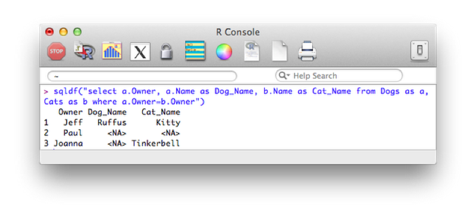

The following code carries out a left outer join, the output of which is show.

    sqldf("select a.Owner, a.Name as Dog_Name, b.Name as Cat_Name from Dogs as a left join Cats as b on a.Owner=b.Owner")

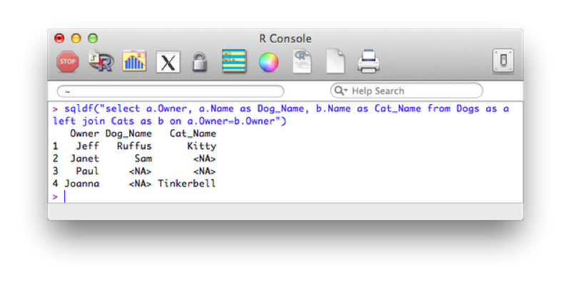

Right and full outer joins are not yet supported in sqldf however they can actually be obtained by simply using the "merge" function (as discussed in Chapter 3).

## 5.2 ggplot2

This is an extremely powerful package that allows for the creation of publication quality plots with ease. There are two basic functions in ggplot2:

1. qplot which allows us obtain quick graphs
2. ggplot which gives us more control of granularity (we will not go into it here)

### Basic plots with qplot

The qplot command is very similar to the plot command in that in will often produce the plot required based on the inputs. To obtain a histogram of the Height.in.Metres variable of the JJJ data set we simply use:

    qplot(data=JJJ,x=Height.in.Metres)

This produces the plot shown.

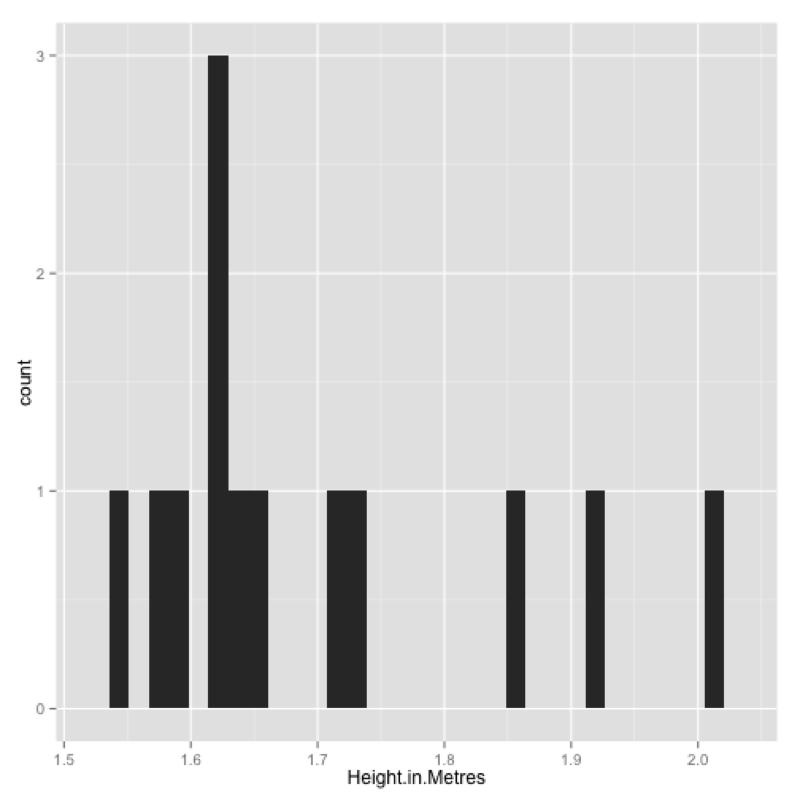

We can improve this by changing the bin width, including a title and changing the labels for the x axis and y axis.

    qplot(data=JJJ,x=Height.in.Metres,binwidth=.075,main="Height of people in the JJJ data set",xlab="Height",ylab="Frequency")

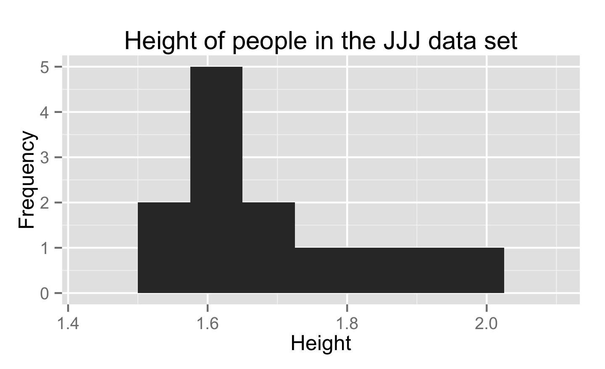

We can obtain a density plot corresponding to the above by using the "density" option for the "geom" argument as shown:

    qplot(data=JJJ,x=Height.in.Metres,binwidth=.075,main="Height of people in the JJJ data set",xlab="Height",ylab="Frequency",geom="density")

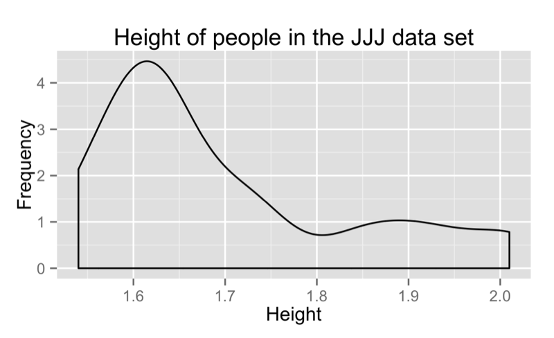

If we pass two vectors to qplot we obtain a scatter plot:

    qplot(data=JJJ,x=Weight.in.Kg,y=Height.in.Metres)

we can also pass qplot a "size" argument to obtain the graph shown:

    qplot(data=JJJ,x=Height.in.Metres,y=Weight.in.Kg,size = Age)

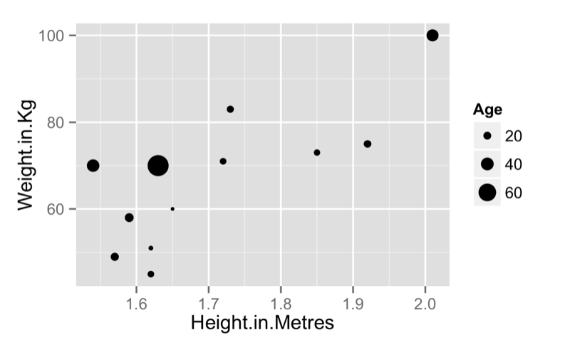

We can of course obtain scatter plots against categorical variables as shown:

    qplot(data=JJJ,x=Sex,y=Height.in.Metres)

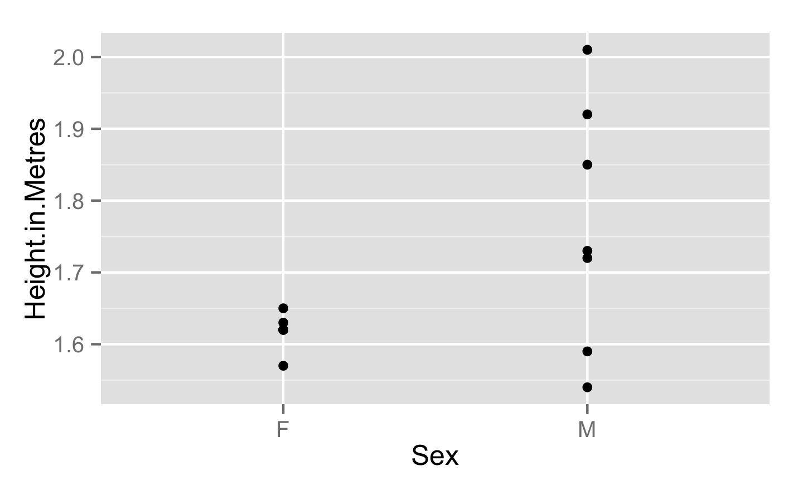

We can pass "boxplot" as the "geom" argument to get a boxplot as shown.

    qplot(data=JJJ,x=Sex,y=Height.in.Metres,geom='boxplot')

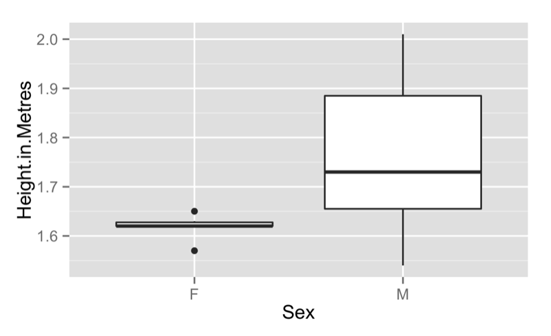

### Advanced features

We can add various features to our scatter plot. The following code just plots a line between all the points:

    qplot(data=JJJ,x=Height.in.Metres,y=Weight.in.Kg,geom="line")

We can combine various geom options so as to not just include a line but also the points:

    qplot(data=JJJ,x=Height.in.Metres,y=Weight.in.Kg,geom=c("point","line"))

Finally we can also add a smoothed line to our plot as shown:

    qplot(data=JJJ,x=Height.in.Metres,y=Weight.in.Kg,geom=c("point","line","smooth"))

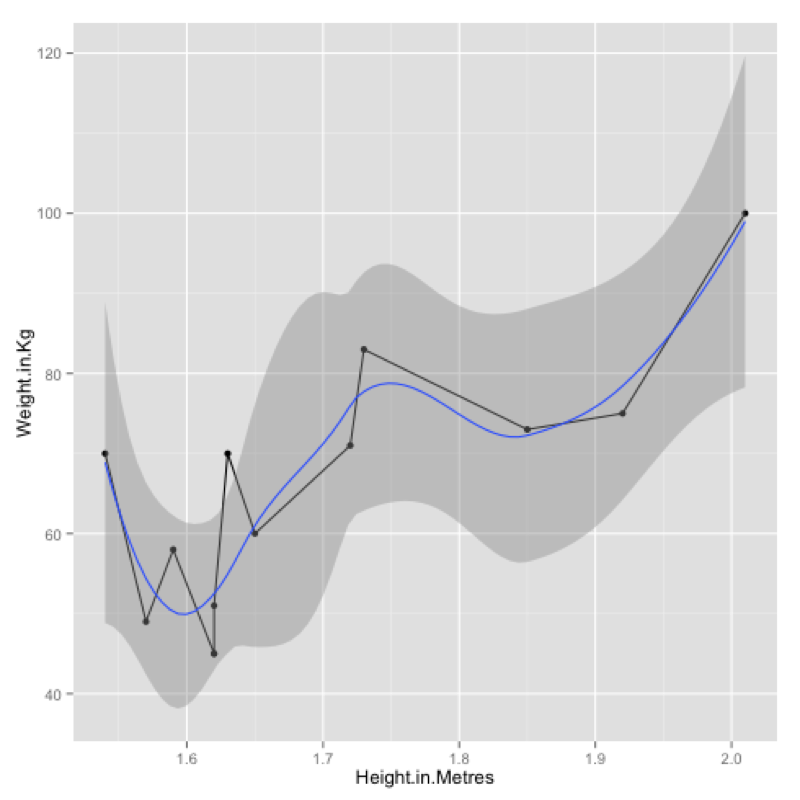

We can very easily obtain a collection of any of the above plots across a categorical variables using the "facets" command as shown:

    qplot(data=JJJ,x=Height.in.Metres,binwidth=.075,facets=~Sex)

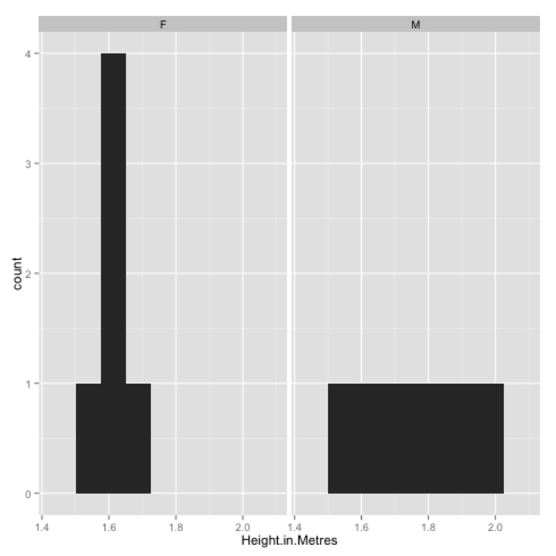

We can use the "ggsave" command to save the last plotted graph to file:

    ggsave(filename="~/Desktop/test.pdf")

###

One final aspect we will take a look at in ggplot2 is that of layers. To do so we will use the following dataset:

    MMMJJJ_to_plot<-within(MMMJJJ,{data_set<-ifelse(substr(MMMJJJ$Name,1,1)=="M","MMM","JJJ");Sex<-substr(Sex,1,1)})

Firstly we create a plot using qplot and assign it to p (recall that everything in R is an object).

    p<-qplot(data=MMMJJJ_to_plot,x=Height.in.Metres,y=Weight.in.Kg,facets=~data_set~Sex,color=Sex)

To view the plot we simply type "p" (note that we have also included a "color" option):

    p

Finally we can add a new layer to this plot by "adding" (+) a linear model to our graph:

    p<-p+stat_smooth(method="lm")

The output of all this is shown.

Finally we can save a particular graph object in ggplot using ggsave:

    ggsave(p,filename="~/Desktop/plot.pdf")

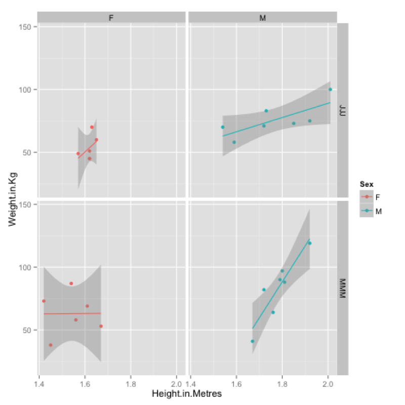

## 5.3 twitteR

The last package we will consider is a package that can be used to data mine twitter.

To get the certain trends we use can use the following code:

    getTrends(period = "daily", date=Sys.Date())
    getTrends(period = "daily", date=Sys.Date() - 1)
    getTrends(period = "weekly")

To obtain tweets for a particular hashtag:

    searchTwitter("#orms")

Finally to obtain tweets from a particular user (the following gives the tweets of the INFORMS as shown):

    userTimeline("INFORMS")

