# MAT013 Advanced use of statistical packages - SAS

Chapter 1 - Introduction

1. The environment
2. Libraries
3. Importing data
4. Exporting data

Chapter 2 - Basic Statistical Procedures

1. Procedures
2. A list of procedures
3. Exporting output

Chapter 3 - Manipulating Data

1. Data steps
2. The program data vector
3. Creating new variables
4. Handling dates

Chapter 4 - Programming

1. Flow control
2. SAS Macro compiler
3. Global and local macro variables
4. Macro Programming Statements
5. Macro Functions

Chapter 5 - Further procs

1. SQL
2. Functions
3. Optimisation

---------------

# Chapter 1 - Introduction

---------------

## 1.1 The Environment

SAS may be run in a variety of modes, on this course we will concentrate on the interactive mode which allows users to submit selected portions of SAS code through a graphical user interface (GUI). When opening SAS a variety of windows immediately become visible as shown. Note that the screenshots and accompanying screen casts for this course were produced with SAS 9.3 running on ubuntu 11.10. The look and feel on other operating systems will differ slightly.

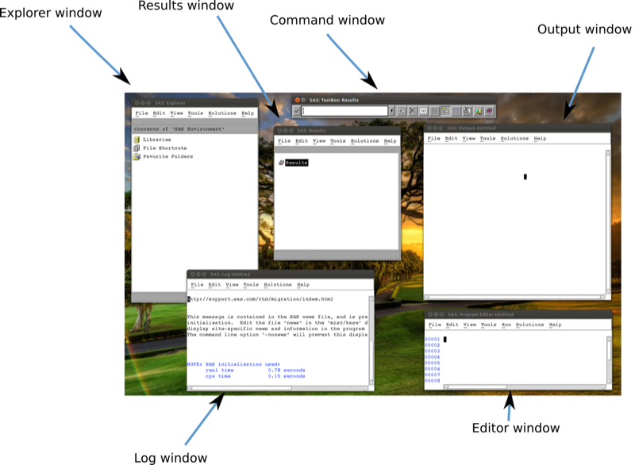

The visible windows are:

1. The explorer window
2. The results window
3. The command window
4. The output window
5. The log window
6. The editor window

We write code directly in the editor window and the roles of the other windows will become clear shortly.

## 1.2 Libraries

The major strength of SAS is its ability to handle huge data sets. SAS does this by storing files in a particular format in spaces called libraries. SAS libraries are important. SAS manipulates data sets once they are converted to SAS data files. These data files are saved in libraries in SAS. They work just like folders (apart from not being able to nest further libraries). If you click on the libraries tab in the explorer window (as shown in in the screenshot) you should see the libraries available to you (as shown in the other screenshot).

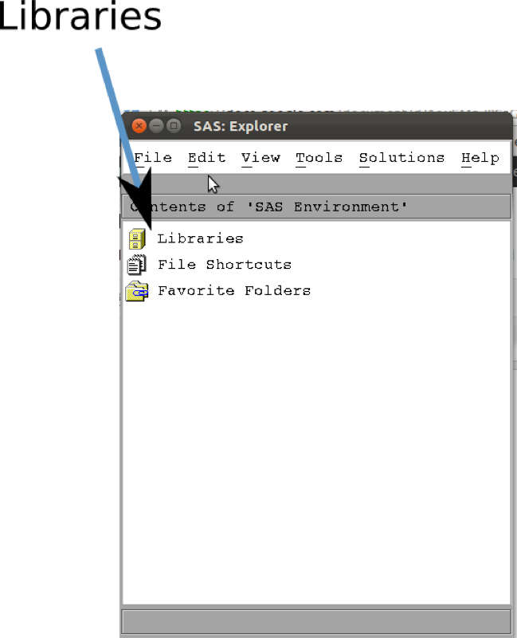

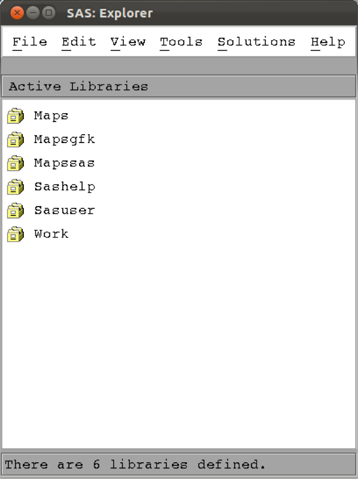

On my system SAS has already created 6 libraries (this might differ on other versions and operating systems). The Work library which SAS automatically uses if no library is specified (more on this later, it's basically the default library). A very important fact about the Work library is that it is temporary. When SAS is shut down, all the contents of the Work library are deleted. Keeping this in mind, let's move on to creating a new library.

### Creating a new library

To create a new library, left click in the explorer window and select "New...". You will see a new window appear as shown. Simply browse to the location on your computer at which you'd like your new library to be stored. Note also to click the "Enable at startup" option which ensures that SAS remembers this library the next time you open up SAS; if this is not selected, the link to the library created will be temporary (and erased when SAS is shut down). Finally make sure you name your library obeying the following rules (for the rest of the notes, I'll assume the library name for this course is `mat008`):

1. be less than or equal to 8 characters
2. must begin with an underscore or letter
3. remaining characters can be letters, numbers or underscores

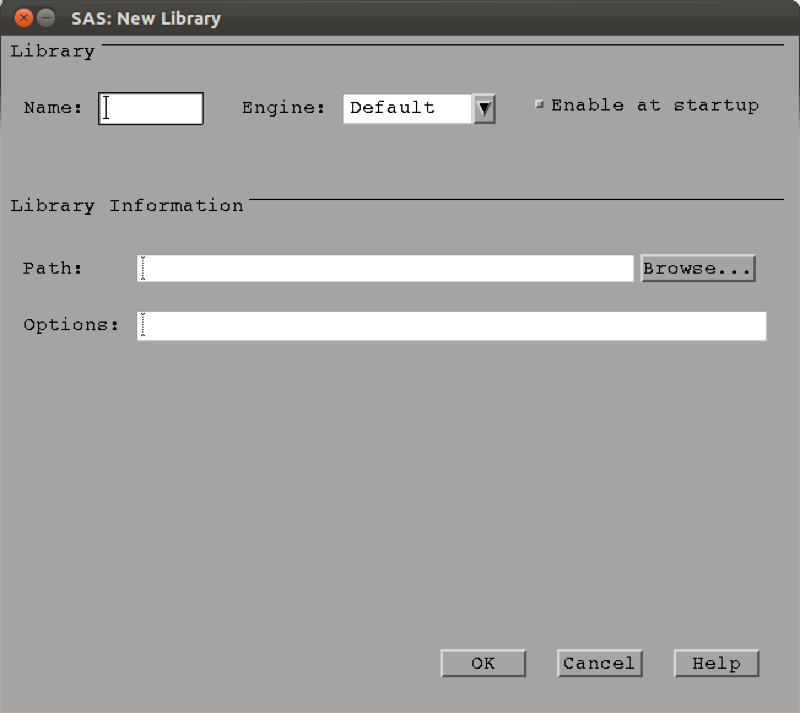

Now that we have a library let's import some data!

## 1.3 Importing Data

There are two main ways to import data into SAS:

1. Direct input
2. Importing an external data set (xls, csv etc...)

In practice you will never use the direct input method but let's take a look for completeness (although it is very useful when wanting to quickly test a few things). This will also give us our first experience of the editor window!

Let us create a data set named "first_data_set", put it in the "MAT008" library and include the following data:

    Name,Age
    Bob,23
    Billy,25

To do so, write the following code in the editor window:

    data MAT008.first_data_set;
    input Name $ Age;
    cards;
    Bob 23
    Billy 25
    ;
    run;

Let's take a look at the screenshot. First of all we see that the program editor automatically includes some syntax colouring (i.e. changes the colour of some of the words that it recognises). In blue in the editor window are the SAS keywords:

1. "data" which tells SAS that we're about to write a "data step" which we'll look at a bit closer in the Chapter 3. The keyword data is always followed by the library and the data file (separated by a ".") we're creating. If no library is given then SAS will put this file in the Work library.
2. "input" which tells SAS that we're going to input raw data and what follows is the name of the variables. If a variable is a string then we must include a "\$" after the variable name.
3. "cards" which is the SAS keyword that precedes the raw data. All the entries must be on separate rows.
4. "run" which is the keyword that tells SAS where the statement ends.

An important thing to remember is that a SAS statement always ends with a ";". Forgetting the ";" is a common source of mistakes (and headaches).

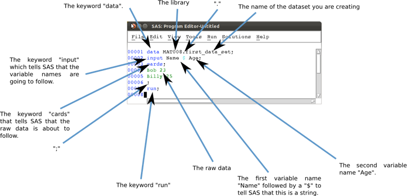

We run this code by highlighting it and pressing the 'running man', clicking on run (or pressing F8 on Windows). It is good practice to always check the log window as soon as any code is run. In the screenshot we see that the log looks good (lines 1-7 don't show any errors) and simply gives some details as to the running of the program.

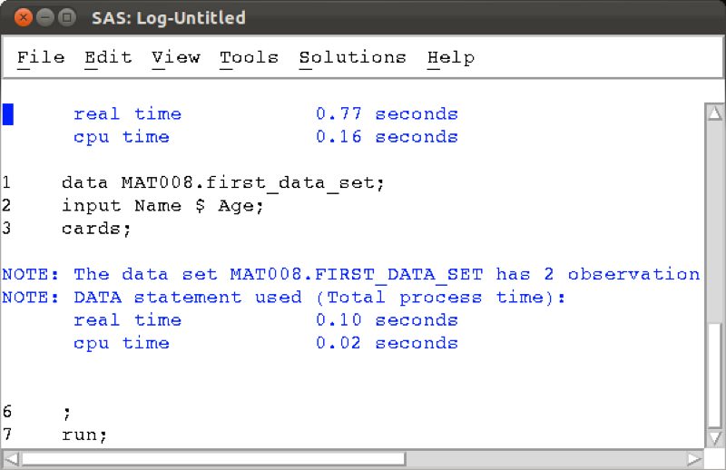

If we now look at the MAT008 library in the explorer pane we can see the new data set is in there, double clicking on the data set opens it up.

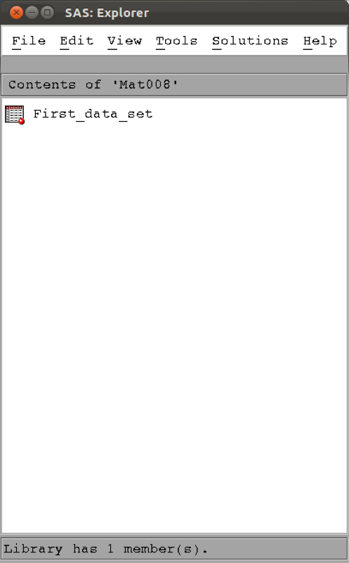

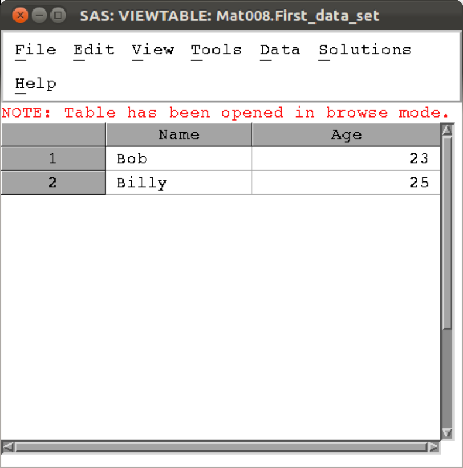

Using direct input is of course not at all realistic when trying to import larger data sets.

Often large data sets will be saved in comma-separated values (csv) format which can be read by most (all?) software. We will import the data set shown (here viewed in a simple text editor).

We will import this data set in to the MAT008 library and call it JJJ using the following code:

    proc import datafile="~/JJJ.csv"
        out=mat008.JJJ
        dbms=csv
        replace;
        getnames=yes;
    run;

Let's take a look at the screenshot shown. We again see that the program editor automatically includes some syntax colouring (i.e. changes the colour of some of the words that it recognises). In blue in the editor window are the SAS keywords:

1. "proc" which tells SAS that we're about to write a "procedure step" which we'll look at a bit closer in the next chapter. The "proc" keyword is always followed by the name of the particular procedure we're going to use. In this case: "import", which is then followed by the statement "datafile=path-to-datafile". Following this are various options relating to the import statement.
2. "out" - this tells SAS the name of the SAS datafile created from the imported file.
3. "dbms" - this tells SAS the type of file being imported (in our case csv, but can be "dlm", "xls", etc.). Note that this is not necessary if SAS can recognise the file extension.
4. "replace" - this tells SAS to replace any SAS datafiles with the same name as specified by "out".
5. "getnames=yes" which, although this is not a SAS keyword, it is a special option for the import statement that allows you to tell SAS to get the variable names from the first row of your external data file.
6. "run" is the keyword that tells SAS where the statement ends.

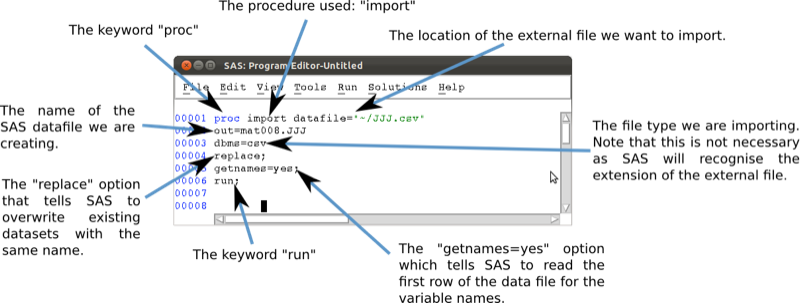

Running the code in the same way as before (highlighting and F8) will create the required datafile as shown.

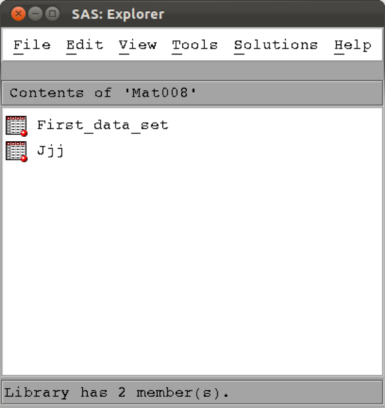

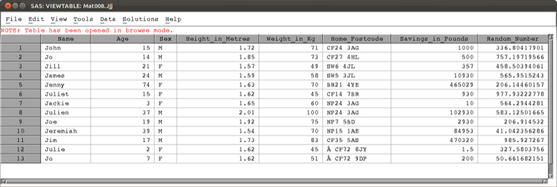

In the following chapters we will learn how to create new data sets from old data sets and as such it may become necessary to export files to csv.

## 1.3 Exporting data sets

We will export our first data set ("mat008.first_dataset") to csv using the following code:

    proc export data=mat008.first_data_set
        outfile="~/Desktop/first_data_set.csv"
        dbms=csv
        replace;
    run;

Let's take a look at the screenshot shown. In blue are the SAS keywords:

1. "proc" which tells SAS that we're about to write a "procedure step" which we'll look at a bit closer in the next chapter. The "proc" keyword is always followed by the name of the particular procedure we're going to use. In this case: "export", which is then followed by the statement "data=" followed by the library and name of the SAS data file you want to export. Following this are various options relating to the export statement.
2. "outfile" - this tells SAS where the exported file should go.
3. "dbms" - this tells SAS the type of file to create when exporting (in our case csv, but can be "dlm", "xls", etc...). Note that this is not necessary if SAS can recognise the file extension.
4. "replace" - this tells SAS to replace any file with the same name as specified by "outfile".
5. "run" is the keyword that tells SAS where the statement ends.

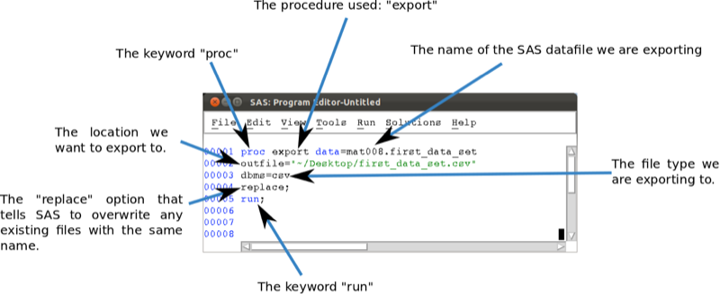

In the next chapter we will see more complex (and potentially useful) procedures.

---

# Chapter 2 - Basic Statistical Procedures

---

## 2.1 Procedures

In the previous chapter we were introduced to some very basic aspects of
SAS:

1. what SAS looks like
2. how to import data into SAS
3. how to export data from SAS

In this chapter we will take a closer look at "procedure steps" which allow us to call a SAS procedure to analyse or process a SAS dataset. In the previous chapter we have already seen two procedure steps:

1. proc import
2. proc export

The procedures we are going to look at in this chapter are:

1. Viewing datasets
2. Summarising the contents of data sets
3. Obtaining summary statistics of data sets
4. Obtaining frequency tables
5. Obtaining linear models
6. Plotting data

The general syntax for these procedures in SAS is given below:

    proc [NAME OF PROCEDURE] data=[NAME OF SAS DATA SET];
    [Options for Procedure being used]
    run;

Some of the options that can be used in a procedure step include:

1. "var" - which tells SAS which variables are to be processed.
2. "by" - which tells SAS to compartementalize the procedure for each different value of the named variable(s). The data set must first be sorted by those variables.
3. "where" - select only those observations for which the expression is true.

## 2.2 A list of procedures

### Utility procedures

We have already seen that we can open and view a data set by simply double clicking on the data set in the explorer window. A data set can also be viewed by using the "print" procedure.

We'll do this by considering the MMM data file shown (imported using an import procedure).

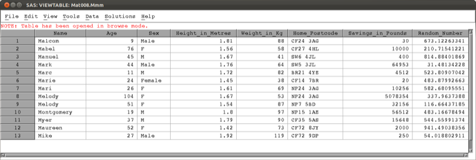

The following code will run the "print" procedure:

    proc print data=mat008.mmm;
    run;

which outputs the data set to the output window as shown.

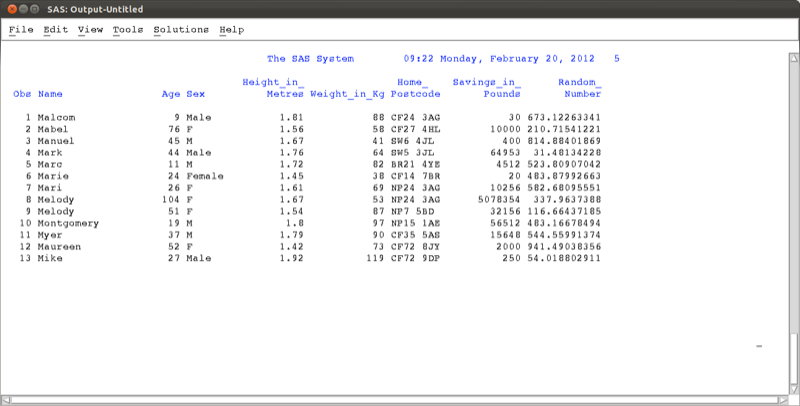

At times we might not want to open the data set but simply gain some information as to what is in the data set. This is equivalent to checking the label on a present without unwrapping it. We do this using the "contents" procedure.

    proc contents data=mat008.mmm;
    run;

This outputs summary information as shown.

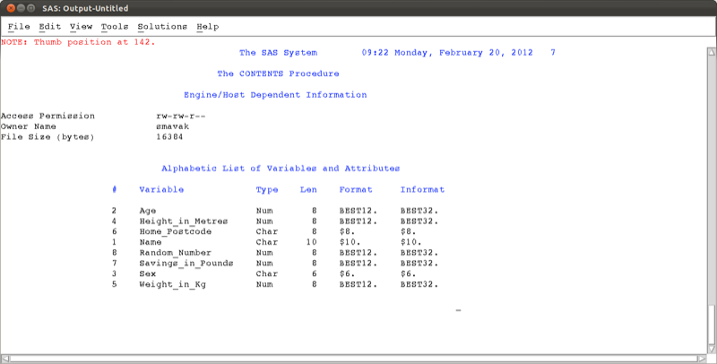

A procedure that will be needed, when using more complex procedures and
larger data sets, is the "sort" procedure.

    proc sort data=mat008.mmm;
    by age;
    run;

Note that this procedure makes use of the "by" statement which tells SAS which variable to sort our observations on (in this case the variable age). Recall that the data set is not sorted. If we run the above "sort" procedure, at first nothing seems to happen, however if we view the data set again (using proc print or otherwise) we see (as shown) that the data set is now sorted.

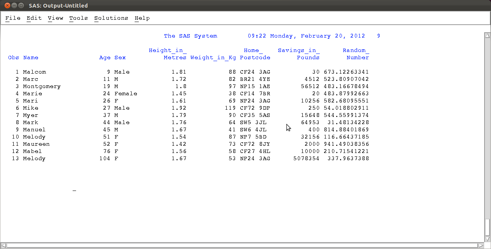

Important: If you have the mat008.mmm data set open in browser mode (i.e. having double clicked on the data set in the explorer window) when running the "sort" procedure, checking your log shows you an error as shown. Always close any browser windows when processing a data set - or use the "print" procedure!

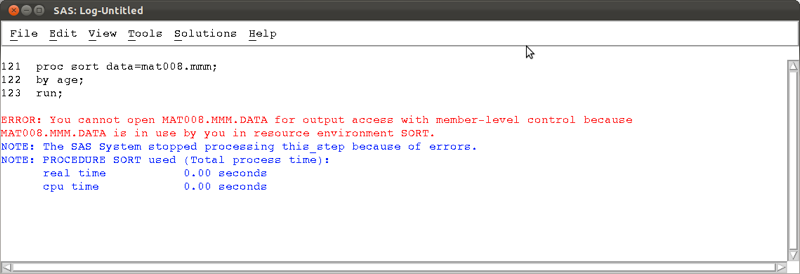

### Descriptive statistics

In this section we will go over some of the procedures needed to obtain descriptive statistics.

The first procedure we consider is the "means" procedure. We can use the following code to obtain various summary statistics relating to the age variables of the mat008.mmm dataset.

    proc means data=mat008.mmm;
    var age;
    run;

We can specify the particular summary statistics we want (if none are specified a default set is displayed).

    proc means data=mat008.mmm N mean std min max sum var css uss;
    var age;
    run;

We can also choose to display the summary statistics for more than one variable

    proc means data=mat008.mmm N mean std min max sum var css uss;
    var age height_in_metres;
    run;

We can compartmentalise our data results using the "by" statement. Note that the data set must be sorted on the same variable.

    proc means data=mat008.mmm N mean std min max sum var css uss;
    var age height_in_metres;
    by sex;
    run;

Another way of compartmentalising results is using the "class" statement. This is very similar to the "by" statement and does not require the prior sorting of your data set.

    proc means data=mat008.mmm N mean std min max sum var css uss;
    var age height_in_metres;
    class sex;
    run;

Finally, it's also possible to create a data set from the "means"
procedure.

    proc means data=mat008.mmm N mean;
    var age height_in_metres;
    class sex;
    output out=summary_of_mmm
    N(age)=number_of_age_obs
    mean(age)=average_of_age_obs
    N(height_in_metres)=number_of_height_obs
    mean(height_in_metres)=average_height;
    run;

The above code creates a data set called "summary_of_mmm" in the work library (the default library if no library is specified) with two variables "number_of_obs" and "average_of_obs" which give the number and mean for the observations as calculated by the "means" procedure as shown.

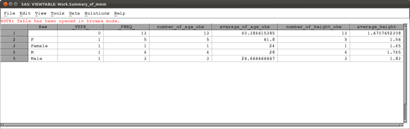

The "univariate" procedure allows for the calculation of univariate statistics in SAS. The following code will output all the default univariate statistics for all the variables.

    proc univariate data=mat008.mmm;
    run;

We can choose to run the "univariate" procedure on a subset of the variables, using the "var" statement.

    proc univariate data=mat008.mmm;
    var savings_in_pounds;
    run;

The various outputs of the "univariate" procedure are shown.

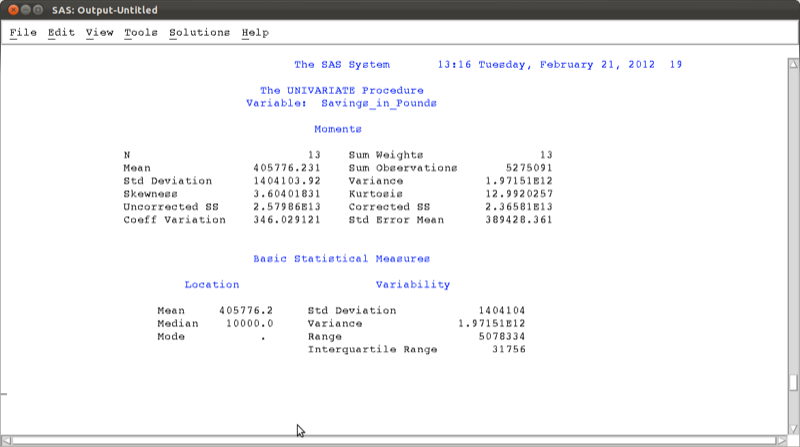

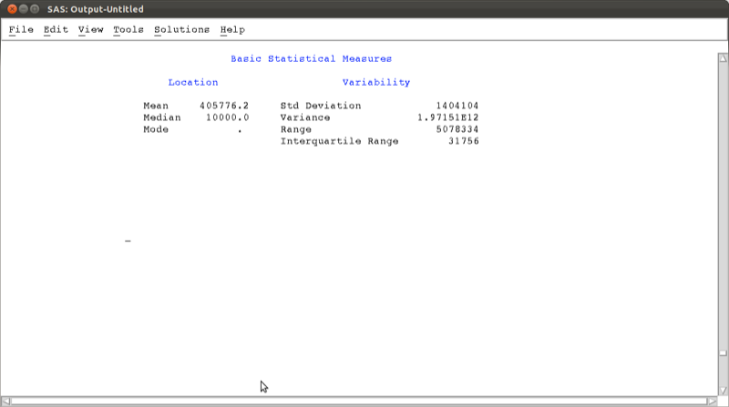

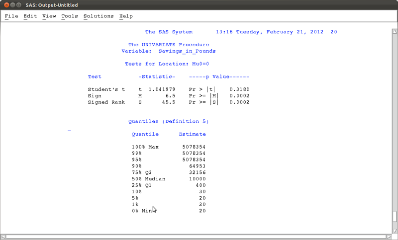

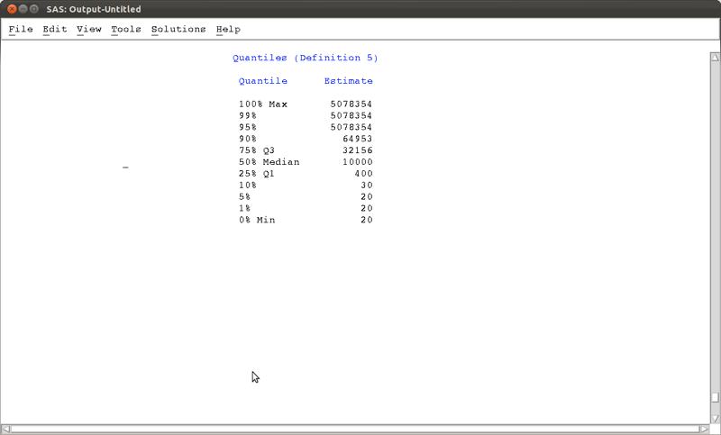

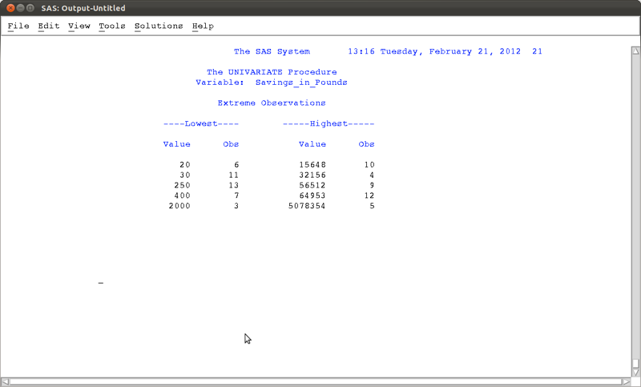

### Frequency tables

The "freq" procedure allows us to obtain frequency tables of data sets. As an example, let's consider the dataset shown.

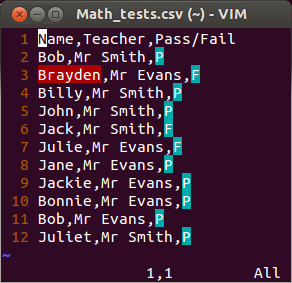

The most basic "freq" procedure will give the frequencies of all the observations in the data set:

    proc freq data=mat008.math_tests;
    run;

We can specify the variables we want to look at by listing them after the "tables" statement (similar to the var statement for the "means" procedure):

    proc freq data=mat008.math_tests;
    tables teacher pass_fail;
    run;

If we want to cross tabulate the data then we use a `*` in between the variables concerned:

    proc freq data=mat008.math_tests;
    tables teacher*pass_fail;
    run;

The above code gives the table shown.

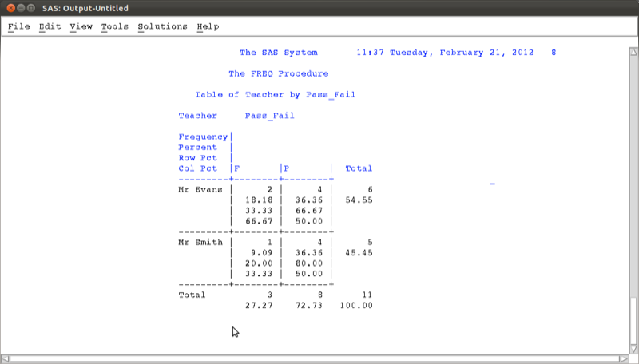

Various options can be passed to the "freq" procedure, the simplest of which is shown below:

    proc freq data=mat008.math_tests;
    tables teacher*pass_fail / nocol norow nopercent;
    run;

Other options include computing a chi square test but we will not worry about that for now.

### Correlations

The "corr" procedure can be used to obtain correlations in SAS. The following code is the basic "corr" procedure applied to the mat008.mmm data set which gives the output shown.

    proc corr data=mat008.mmm;
    run;

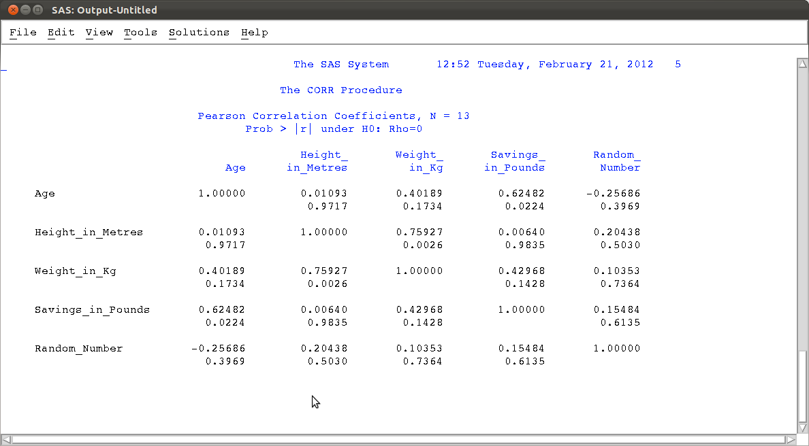

If we want to run the "corr" procedure on a subset of the variables then we use the "var" statement:

    proc corr data=mat008.mmm;
    var age savings_in_pounds;
    run;

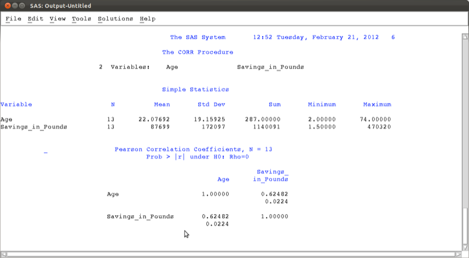

### Linear Models

In this section we'll very briefly see the syntax for some basic linear models in SAS. First of all we'll take a look at linear regression. The following code will run such an analysis on the mat008.jjj data set, checking if there is a linear model of height with predictors weight and savings:

    proc reg data=mat008.jjj;
    model height_in_metres=weight_in_kg savings_in_pounds;
    run;

Looking at the p-value we see that the overall model should not be rejected, however the detailed results show that perhaps we could remove savings from the model.

Analysis of variance (ANOVA) can be done very easily in SAS. We show this using a new data set.

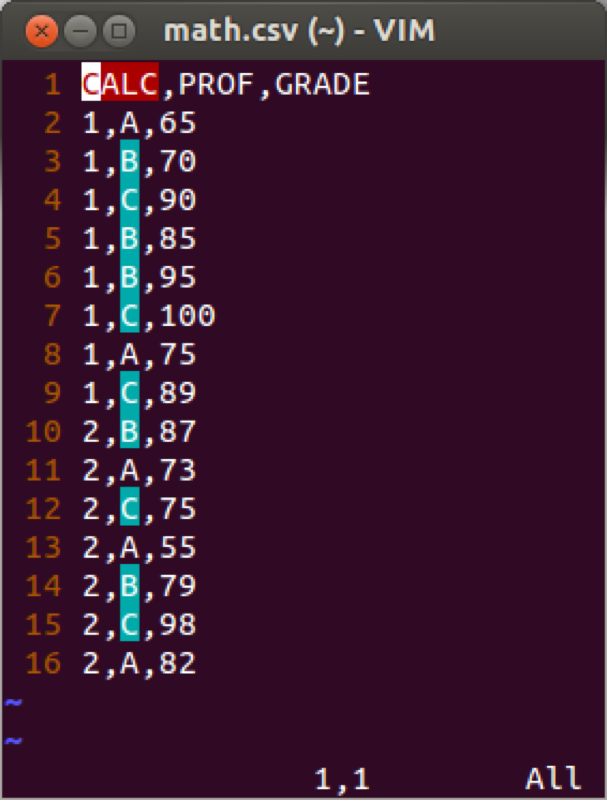

We will use the "anova" procedure to see if the grades obtained by students depend on their teacher.

    proc anova data=mat008.math;
    class prof;
    model grade=prof;
    run;

Note the "class" keyword is needed to state which variable we are using to group on. The results show that there is indeed a difference between groups (further post-hoc tests are needed to investigate which groups differ etc.).

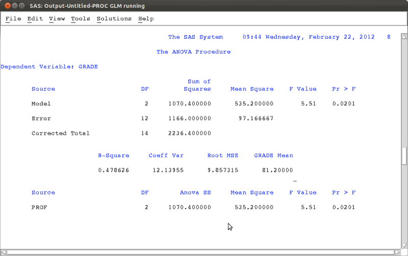

Another procedure that can be used for a variety of models (including the 2-way anova) is the "glm" (general linear model) procedure. The following code simply reproduces the above results.

    proc glm data=mat008.jjj;
    model height_in_metres=weight_in_kg savings_in_pounds;
    run;

    proc glm data=mat008.math;
    class prof;
    model grade=prof;
    run;

### Plots and charts

There are various ways to obtain histograms in SAS, the easiest way is to use the "univariate" procedure with the "histogram" option. The following code gives a histogram for the height of individuals in the mat008.jjj dataset as shown.

    proc univariate data=mat008.jjj;
    var height_in_metres;
    histogram;
    run;

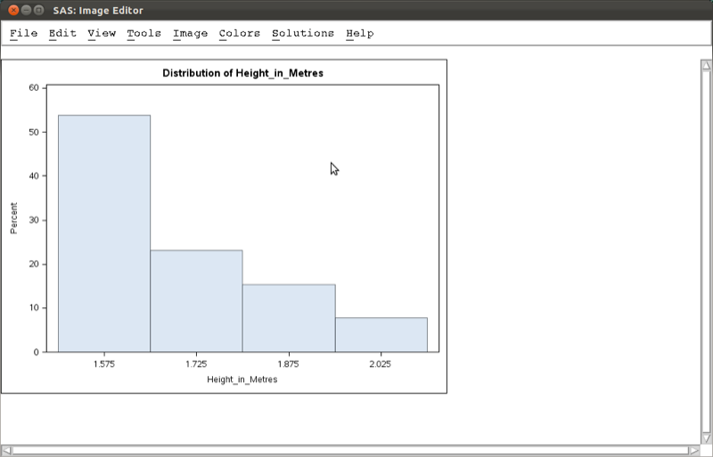

There are various ways to obtain scatter plots in SAS, the easiest way is to use the "gplot" procedure. The following code gives a scatter plot for the height of individuals against their weight in the mat008.jjj dataset as shown.

    proc gplot data=mat008.jjj;
    plot height_in_metres*weight_in_kg;
    run;

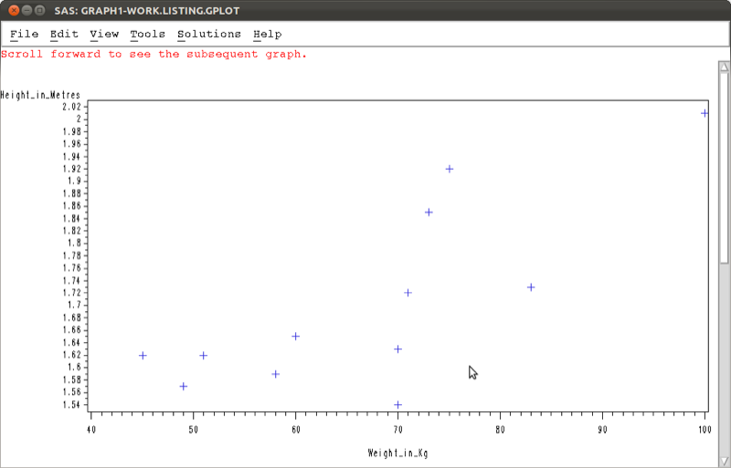

There are various other ways to obtain similar graphs as well as change the look and feel of our graphs. We won't go into this here but you are encouraged to look into it.

## 2.3 Exporting output

We can output results of procedures in SAS using the "output delivery system". The syntax is straightforward and we surround normal SAS code with the "ods" statements to output to various formats (html, pdf, rtf).

    ods [format of your choice] file=[Location of file to be output];
    [Normal SAS code]
    ods [format of your choice] close;

As an example, the following code creates an html file called "freq_table" in html format stored at the location "\~/Desktop" (note that in Window's the "/" should be a "\") as shown.

    ods html file="\~/Desktop/freq_table.htm";

    proc gplot data=mat008.jjj;
    plot height_in_metres*weight_in_kg;
    run;

    ods html close;

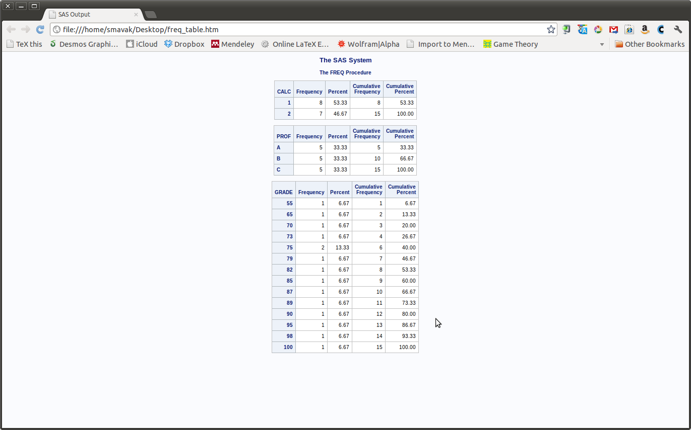

The following code will create a file called "scatter_plot.pdf" in pdf format stored at the location "\~/Desktop" (note that in Window's the "/" should be a "\") as shown.

    ods pdf file="\~/Desktop/scatter_plot.pdf";

    proc gplot data=mat008.jjj;
    plot height_in_metres*weight_in_kg;
    run;

    ods pdf close;

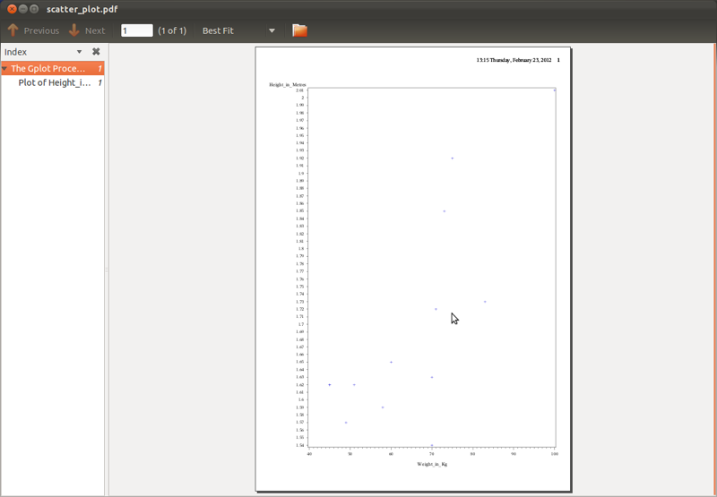

The following code will create a file called "regression.rtf" in rtf format (Word, LibreOffice etc.) stored at the location "\~/Desktop" (note that in Window's the "/" should be a "\") as shown.

    ods rtf file="\~/Desktop/regression.rtf";

    proc reg data=mat008.jjj;
    model weight_in_kg=height_in_metres;
    run;

    ods rtf close;

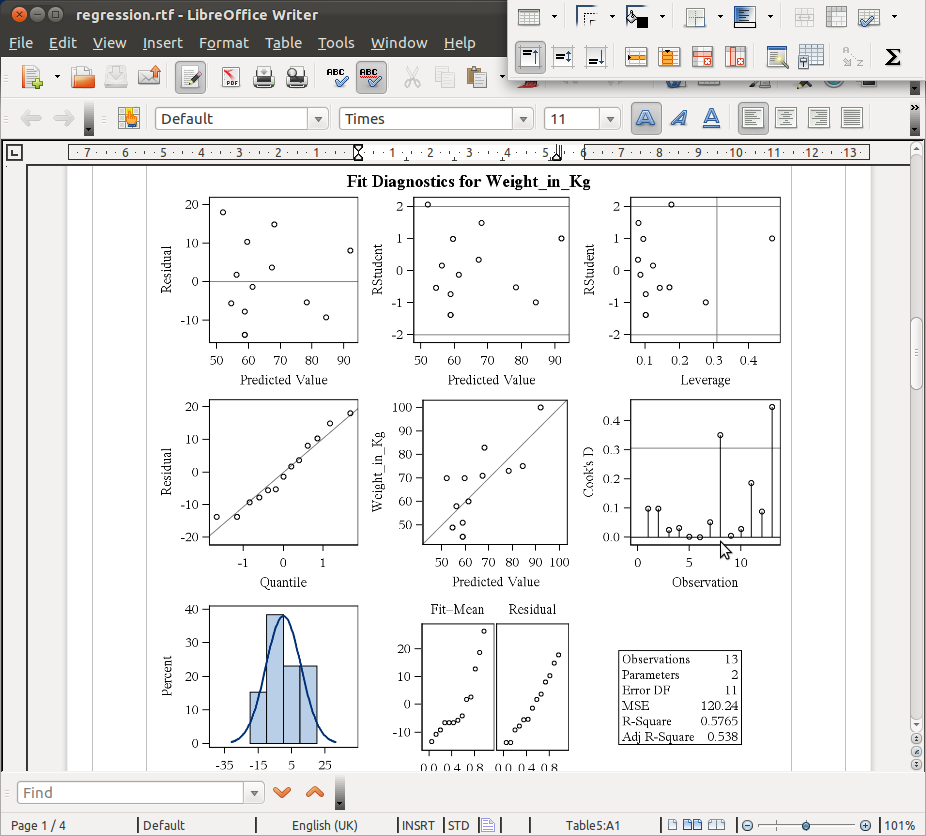

---

# Chapter 3 - Manipulating data

---

## 3.1 Data steps

A data step is a type of SAS statement that allows you to manipulate SAS data sets. Some of the things we can do include:

1. Copying a data set (with new variables)
2. Concatenating any number of data sets
3. Merging any number of data sets

The following code simply creates a data set in the work library called "J" that is a copy of the data set jjj located in the mat008 library.

    data j;
    set mat008.jjj\
    run;

To concatenate two data sets (as shown pictorially) we use the following syntax:

    data [New Data Set];
    set A B;
    run;

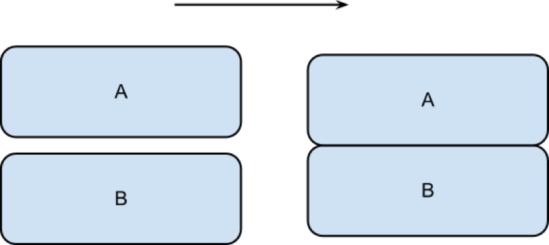

The following code concatenates the jjj and mmm data sets as shown.

    data mat008.mmmjjj;
    set mat008.mmm mat008.jjj
    run;

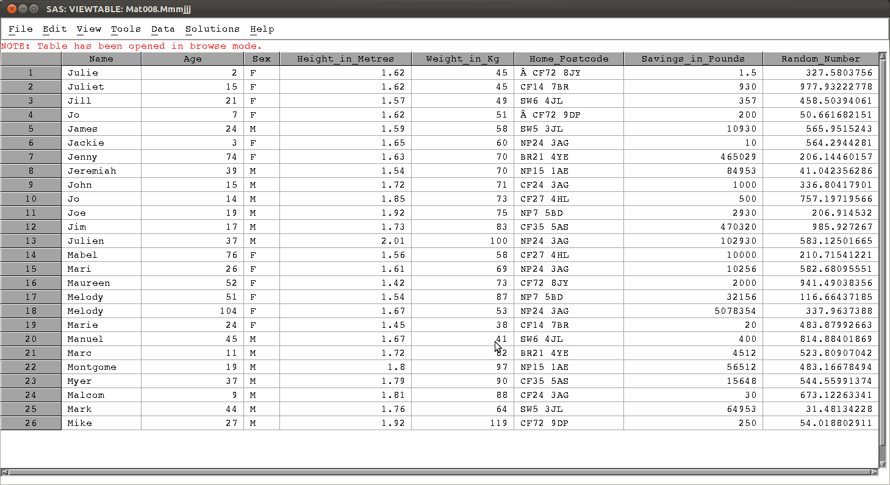

To merge two data sets (as shown pictorially) we use the following syntax:

    data [New Data Set];
    merge A B;
    by [Merge Variable]
    run;

Note that the two data sets must be sorted on the merge variable prior to merging.

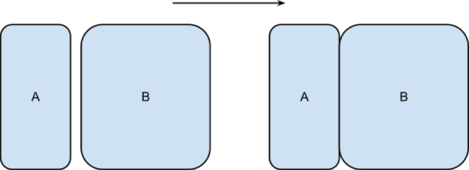

The following code would merge the two data sets first_data_set and other_data_set in the mat008 library as shown.

    proc sort data=mat008.first_data_set;
    by name;
    run;

    proc sort data=mat008.other_data_set;
    by name;
    run;

    data mat008.merged_data_set;
    merge mat008.first_data_set mat008.other_data_set;
    by name;
    run;

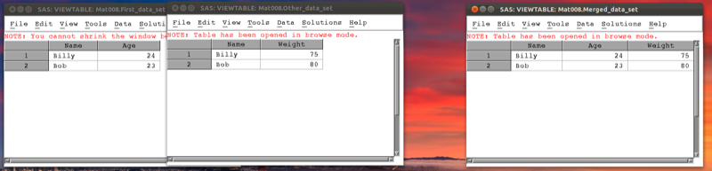

Data steps can be used in conjunction with the "where" statement to select certain variables. For example consider the data set shown.

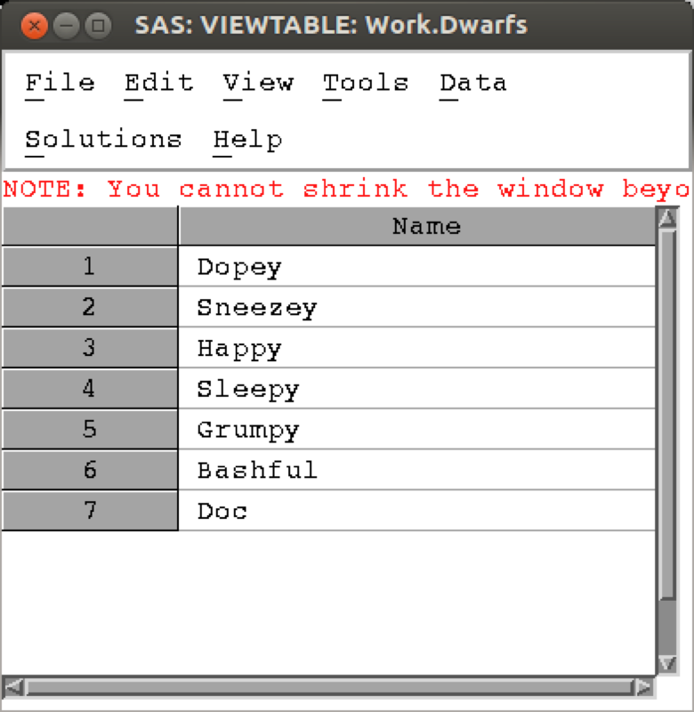

The following code selects only the elements of the above data set that start with a "D".

    data Dwarfs;
    set Dwarfs;
    where substr(Name,1,1)="D";
    run;

The result is shown in (note that the above code makes use of the "substr" function that we will see later).

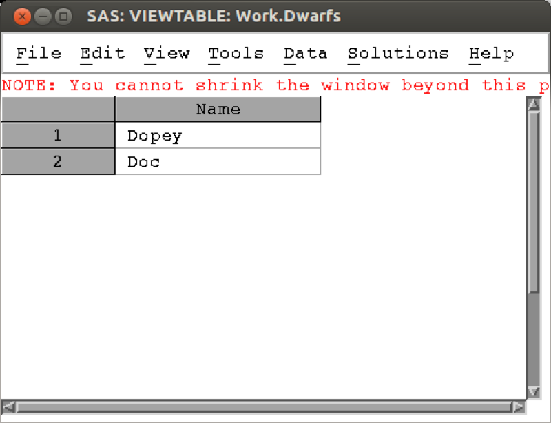

## 3.2 The program data vector

SAS is able to handle very large data sets because of the way data steps work. In this section we'll explain how it uses the "program data vector" (pdv) to efficiently handle data. The basic steps of compiling a data step are as follows:

1. SAS creates an empty data set.
2. SAS checks the data step for any unrecognized keywords and syntax errors.
3. SAS creates a PDV to store the information for all the variables required from the data step.
4. SAS reads in the data line by line using the PDF.

(If a "by" statement is used (for example when merging two data sets) the PDF does not empty if there are still observations with the same value of the "by" variable).

5. SAS creates the descriptive portion of the SAS data set (viewable using the "contents" procedure).

An example of how this works with concatenation and an example of how this works with merging is shown.

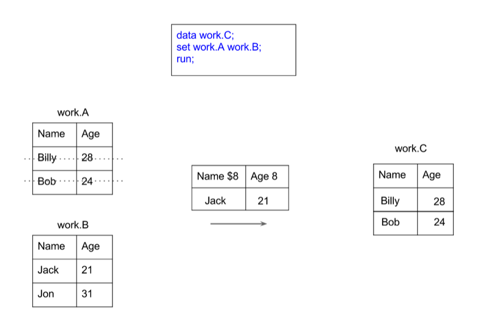

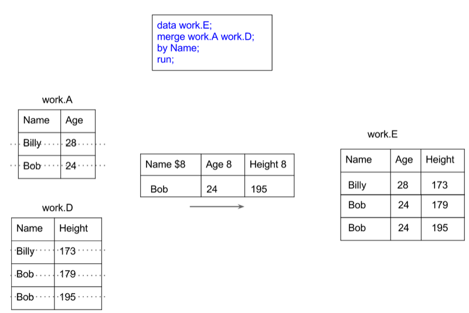

## 3.3 Creating new variables

Creating new variables using various arithmetic and/or string relationships is relatively straightforward in SAS. The following code creates a new data set call MMM_with_BMI, with a new variable "BMI" as a function of the height and weight variables in the MMM dataset in the mat008 library.

    data mat008.MMM_with_BMI;
    set mat008.MMM;
    bmi=weight_in_kg/(height_in_metres**2);
    run;

Some of the arithmetic functions are shown.

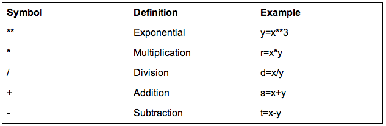

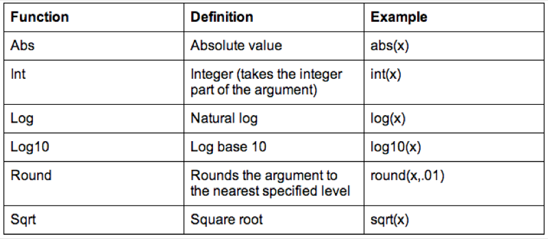

We can also do operations on strings, the following code replaces the variable "Sex" with the first entry of "Sex" (which gets rid of the Male - M and Female - F issue).

    data mat008.MMM_with_BMI;
    set mat008.MMM;
    sex=substr(sex,1,1);
    run;

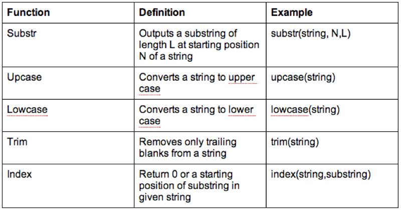

It's worth checking the web for a full list of various SAS functions (there are a huge amount of them).

### Dropping and keeping variables.

In this section we'll take a quick look at two simple ways of improving the efficiency of a data step. Recalling how SAS handles a data step (using the pdv as described previously), one immediate way of improving efficiency is to ensure that the pdv only "transports" the variables we require. We do this with the "drop" or "keep" statement.

Let us consider the previous example and assume that we want our MMM_with_BMI data set without the weight and height variables. We use a "drop" statement to get rid of those variables:

    data mat008.MMM_with_BMI_nhw(drop=weight_in_kg height_in_metres);
    set mat008.MMM;
    bmi=weight_in_kg/(height_in_metres**2);
    run;

Note that the following code would not give the required output as we are trying to drop the variables from the original data set, however we need those variables to calculate the bmi:

    data mat008.MMM_with_BMI_nhw;
    set mat008.MMM(drop=weight_in_kg height_in_metres);
    bmi=weight_in_kg/(height_in_metres**2);
    run;

The keep statement (basically) does the same thing as the drop statement but in reverse, by only keeping the variables we have specified. Which one to use depends simply on whether or not you want to drop or keep more variables.

Note that you cannot use a drop statement and a keep statement in the same data step.

The following code will create a data set with just the bmi variable.

    data mat008.just_bmi(keep=bmi);
    set mat008.MMM;
    bmi=weight_in_kg/(height_in_metres**2);
    run;

### Renaming variables

The following code creates a data set "JJJ" in the work library which is a copy of the "JJJ" dataset in the mat008 library, renaming the "sex" variable to "gender".

    data JJJ(rename=(sex=gender));
    set mat008.JJJ;
    run;

This can also be used in the set data set:

    data JJJ;
    set mat008.JJJ(rename=(sex=gender));
    run;

### Operations across rows

We have seen in previous sections how to create new variables for any given observation (i.e. across columns of a data set). In this section we see how to create variables across rows. Recalling how the program data vector works, this implies that we must find a way to keep certain entries in the pdv for future calculation.

We will demonstrate this using the birthday_money.csv data set as shown.

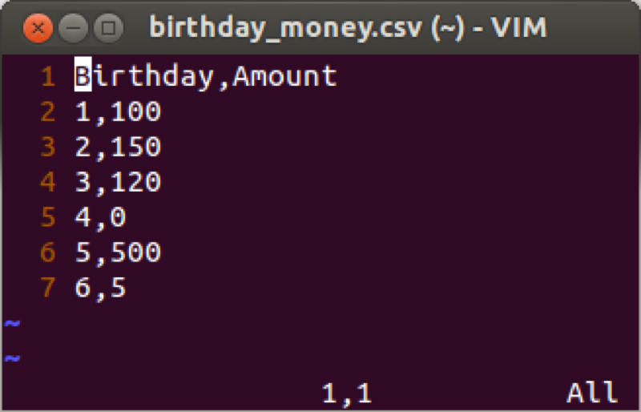

The first such way is to use the "retain" statement. The "retain" statement keeps the last entry for a given variable in the pdv for future calculation. Note that we can give an initial value for a particular variable as shown in the following code (which produces a variable "total" that is a running total of "amount") the output of which is shown.

    data bm_analysis;
    set mat008.birthday_money;
    retain total 0;
    total=total+amount;
    run;

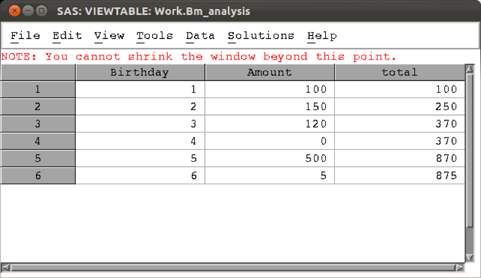

Another tool for such calculations is the "lagn" function which gives the value of a variable from a certain number n of prior steps. The following code gives two new variables, the yearly difference and 2 yearly difference, the result of which is shown.

    data bm_analysis;
    set mat008.birthday_money;
    retain total 0;
    total=total+amount;
    yearly_diff=amount-lag1(amount);
    two_yearly_diff=amount-lag2(amount);
    run;

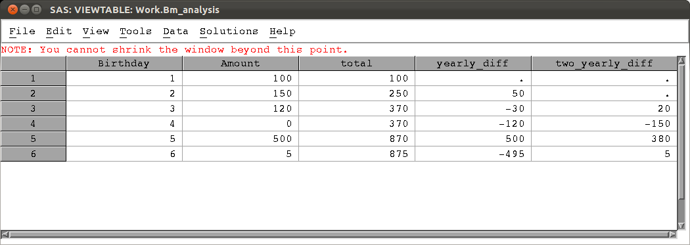

The lag functions can be used in much more complex assignments and in fact when simply wanting to calculate a difference there is a quicker way: using the "difn" function as shown in the code below which gives the same result as shown.

    data bm_analysis;
    set mat008.birthday_money;
    retain total 0;
    total=total+amount;
    yearly_diff=dif1(amount);
    two_yearly_diff=dif2(amount);
    run;

## 3.4 Handling dates

Dates are handled in a particular way in SAS. Let's consider the csv file shown.

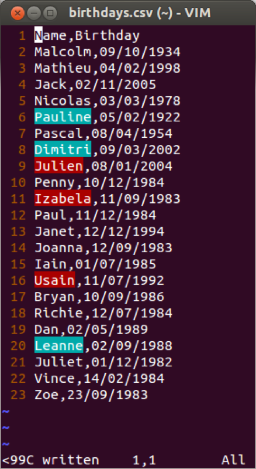

We have seen in Chapter 1 how to import data using proc import. If we use the normal approach an error would occur. This is due to the confusion associated with our birthday variables (the first 20 rows have the date and month values both less than 12). A further option that can be incorporated in proc import is the number of rows that SAS will "pre-read" to identify the type of variables that are to be imported. This is often an easy way to ensure that SAS recognises dates.

    proc import datafile='\~birthdays.csv'
    out=birthdays
    replace;
    getnames=yes;
    guessingrows=25;
    run;

A proc contents run on the above data set shows that the birthday variable data was imported using the informat DDMMYY10. In other words SAS has recognised that the dates were in that particular format.

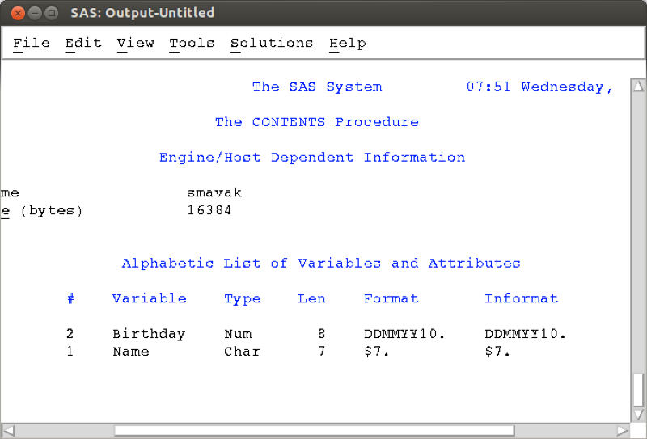

Another approach is to import files in SAS using a data step and the infile statement. When doing this we can tell SAS the format of the data (whether or not it is a string, numerical or date variables).

    data birthdays;
    infile '~/birthdays.csv' dlm=',' firstobs=2;
    input Name $ Birthday ddmmyy10.;
    run;

The infile statement tells SAS where the data is located and the 'dlm' statement tells SAS how the file is delimited (in this case with a comma). The 'firstobs' statement tells SAS where the data starts in the file (in this case the second row as the first row is the name of the variables in our data set). The input statement then allows us to tell SAS the names of the variables as well as the format they are in, here we tell SAS that the second variable is to be called 'Birthday' and it is in the ddmmyy8. format.

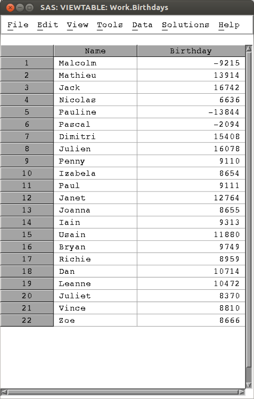

The above output might be a bit confusing, this is due to the fact that SAS handles dates as numbers, using the convention that the 1st of January 1960 is the number 0 (this allows for straightforward arithmetic manipulation of dates). The following code imports the data as above and displays the underlying numeric dates in the date9. format.

    data birthdays;
    infile '\~/birthdays.csv' dlm=',' firstobs=2;
    input Name $ Birthday ddmmyy8.;
    format Birthday date9.;
    run;

The output is shown. Note that applying the date9. format only changes the appearance of the data.

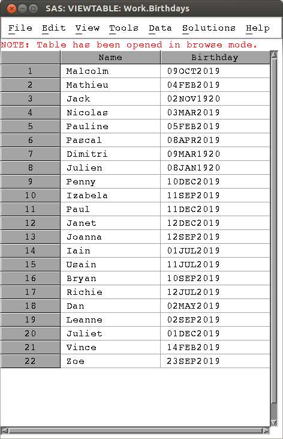

There are various formats that can be used when importing variables (for dates as well as other variables) and subsequently these same formats can be used to display the data if this is required. Searching online quickly finds other SAS formats.

---

# Chapter 4 Programming

---

## 4.1 Flow control

A huge part of programming (in any language) is the use of so called "conditional statements". We do this in SAS using "if" statements. The following code creates a new variable "age_group" which is "young" if the age is less than 29 and "old" if the age is larger than 29. Note we're also including a keep statement to just have the name and age_group in the new data set.

    data age_group(keep= name age_group);
    set mat008.mmmjjj;
    if age<30 then age_group='young';
        else age_group='old';
    run;

We can also use this in conjunction with the else if statement as shown
below:

    data age_group(keep= name age_group);
    set mat008.mmmjjj;
    if age<18 then age_group='child';
        else if age<30 then age_group='young';
            else age_group='old';
    run;

Note that we can also compare strings as shown with the following code:

    data age_group(keep= name age_group);
    set mat008.mmmjjj;
    if age<18 then age_group='child';
        else if age<30 then age_group='young';
            else age_group='old';
    if substr(Name,1,1)='J ' then data_set='JJJ';
        else data_set='MMM';
    run;

Here are some of the comparison operators that can be used in conjunction with 'if' statements.

A further important notion in programming is the notion of loops. These are done in SAS using "do" statements. There are four ways the "do" statement is used:

1. do
2. do (iterative)
3. do while
4. do until

The first use allows us to combine several statement into one. This is often used in conjunction with "if" statements:

    data age_group(keep= name age_group minor_Y_N);
    set mat008.mmmjjj;
    if age<18 then do;
    age_group='Child';
    minor_Y_N='Y';
    end;
    else do;
    age_group='Adult';
    minor_Y_N='N';
    end;
    run;

The 'do' statement can be used to push your computer a bit more. The "do iterative statement" allows you to automate various procedures. The following code output the total number of birthday candles that would have been used on everyones birthday cake in the JJJ data set.

    data candles(keep= name age candles);
    set mat008.jjj;
    candle=0;
    do k=0 to age;
    candle=candle+k;
    end;
    run;

The last two uses of the 'do' statement are very similar and allow us to iterate "until/while" a particular condition is met.

The do until (expression) statement executes a group of statements until the expression within the brackets is satisfied. The validity of the expression is checked at the end of each loop.

    do until (expression);
    data step commands;
    end;

The following code outputs the number of even numbers less than or equal to 70, computing each even number and checking whether or not it is more than 70.

    data even_numbers;
    k=0;
    even=0;
    do until(even>=70);
    even=2**k;
    k=k+1;
    end;
    run;

We can do a similar calculation using the do "while" statement. The do while (expression) statement executes a group of statements whilst the expression within the brackets is satisfied. The validity of the expression is checked at the beginning of each loop.

    do while (expression);
    data step commands;
    end;

    data even_numbers;
    k=0;
    even=0;
    do while(even<70);
    even=2**k;
    k=k+1;
    end;
    run;

Note that do iterative statements (also called "do loops") are often used in conjunction with the "output" statement which empties the pdv to the output data set. The following code outputs the variables in the pdv: "k" and "even" at each iteration of the do statement. The output is shown.

    data even_numbers;
    k=0;
    even=0;
    do while(even<70);
    even=2**k;
    output;
    k=k+1;
    end;
    run;

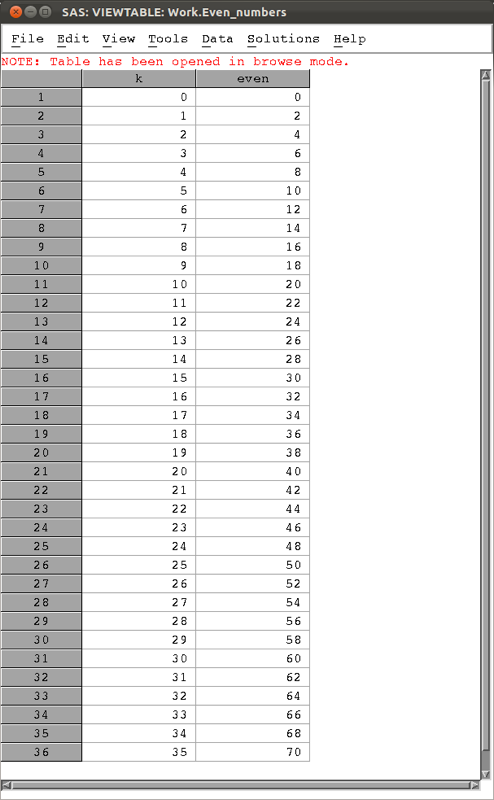

## 4.2 How does SAS compile code?

In this chapter we will see how to program macros in SAS. Macros generate and run code with varying arguments. The macro facility is a tool for extending and customising SAS and for reducing the amount of text you must enter to do common tasks. The macro facility enables you to assign a name to character strings or groups of SAS programming statements. From that point on, you can work with the names rather than with the text itself.

When you submit a SAS macro the Input stack receives content of the program. Word scanner scans each line of the macro for tokens. If a token contains a macro character (a % or a &) that token is sent to the macro compiler. The Macro compiler does its work and places tokens back in the input stack. The token is examined by the word scanner and the process repeats. When the word scanner detects a step boundary it triggers the data step compiler. This process is represented diagrammatically.

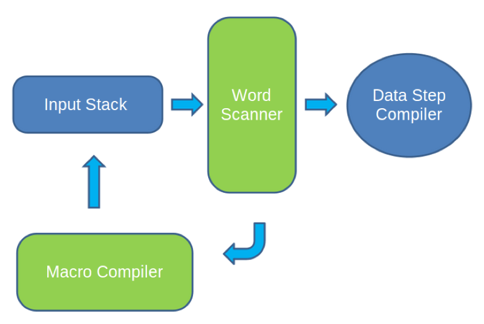

When you submit a macro, it goes first to the macro processor which produces standard SAS code from the macro references (macro code is compiled first). Then SAS compiles and executes your program.

In general the syntax for a macro is as follows:

    %macro macro-name <(macro-parameter-list>;

    … SAS Code...

    %mend <macro-name>;

The following example creates a macro called "My_plot" which when called will plot a graph of height against weight of the variables in mat008.jjj:

    %macro My_plot;
    proc gplot data=mat008.jjj;
    plot height_in_metres*weight_in_kg;
    run;
    %mend;

To run the macro we call it with the following statement:

    %My_plot;

As discussed above, it is possible to pass arguments to a macro. The following code creates a macro "shopping" that will remove a certain quantity "spend" from the variable "life_savings":

    %macro shopping(spend);
    data JJJ_after_shopping(keep= Name Old_savings New_savings);
    set mat008.jjj;
    Old_savings=savings_in_pounds;
    New_savings=saving_in_pounds-&spend;
    run;
    %mend;

Note the ampersand "&" which the "word scanner" will recognise, sending "&spend" to the "macro compiler" where it will resolve to whatever value is passed to the macro.

We can define macros with multiple variables. Consider the following modification of the above code which allows for multiple shopping trips:

    %macro shopping(spend,trips);
    data JJJ_after_shopping(keep= Name Old_savings New_savings);
    set mat008.jjj;
    Old_savings=savings_in_pounds;
    New_savings=saving_in_pounds-&trips*&spend;
    run;
    %mend;

The above code is using so called "positional" macro parameters. It is possible to also use "keyword" macro parameters as shown in the code below.

    %macro shopping(spend=,trips=);
    data JJJ_after_shopping(keep= Name Old_savings New_savings);
    set mat008.jjj;
    Old_savings=savings_in_pounds;
    New_savings=saving_in_pounds-&trips*&spend;
    run;
    %mend;

We can then call the above macro and change the order of the parameters:

    %shopping(trips=2,spend=500);

It's also possible to set default values:

    %macro shopping(spend=,trips=1);
    data JJJ_after_shopping(keep= Name Old_savings New_savings);
    set mat008.jjj;
    Old_savings=savings_in_pounds;
    New_savings=saving_in_pounds-&trips*&spend;
    run;
    %mend;

Now if we call the macro without giving a value to trips it will take the default value 1.

    %shopping(spend=500);

### Macro variables

In this section we're going to take a slightly closer look at macro variables. A macro variable is a variable whose value is stored within the macro symbol table. When the macro variable is used in SAS code, SAS substitutes the value of the macro variable into the SAS code. SAS macro variables are distinguished by the "&" sign before the variable name. Note that all SAS macro variables are stored as text strings.

We can experiment with macro variables using the %let statement which allows the construction of macro variables outside of a macro definition. This is the simplest form of a macro statement. It can be placed anywhere in a program, not only inside a Macro. "%let" creates global macro variables. An example of this is shown in the following code which gives the output shown.

    %let spend=400;
    %let trips=500;

    %macro shopping;
    data JJJ_after_shopping(keep= Name Old_savings New_savings);
    set mat008.jjj;
    Old_savings=savings_in_pounds;
    New_savings=saving_in_pounds-&trips*&spend;
    run;
    %mend;

    %shopping;

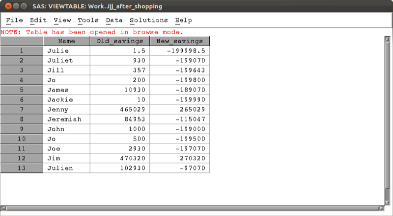

It's also possible to view (in the log) the values of a macro variable using the "%put" statement. There are two uses for it:

    %put <text> &macro-variable-name;

This outputs some <text> (optional) followed by the value of particular macro variable. The other use is shown below:

    %put  <_all_ | _global_ | _local_ >;

This will output either all, all the global or all the local macro variables. These statements should allow us to better understand some of the issues related to the resolution of multiple ampersands. Multiple ampersands can be used to allow the value of a macro variable to become another macro variable reference. The macro variable reference will be rescanned until the macro variable is resolved. There are 2 rules to follow:

1. && is a token in its own right and resolves to &
2. Each token is handled independently

The important thing to note here is that a double ampersand "&&" is a token in itself that resolves to a single ampersand "&" (THIS IS IMPORTANT).

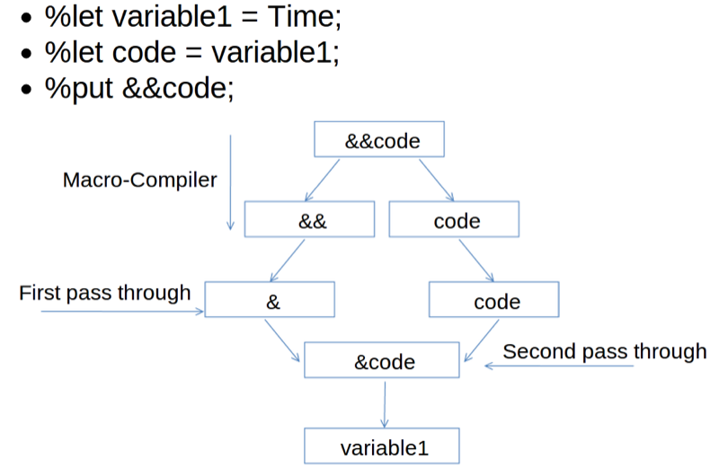

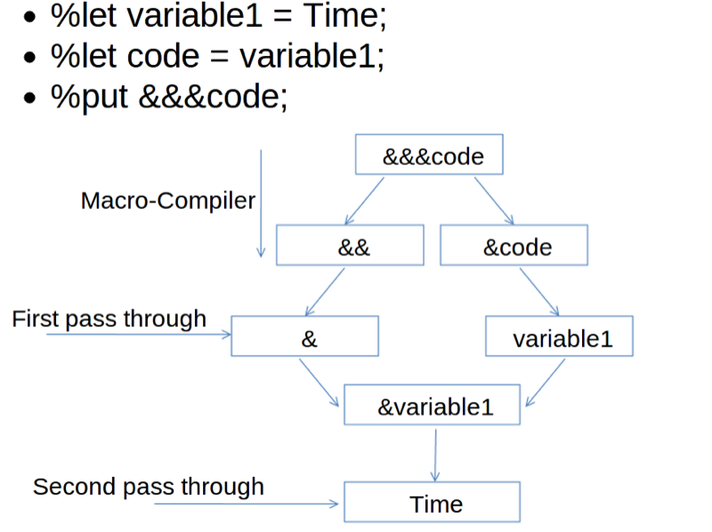

## 4.3 SAS Macro programming statements

The 'if' statements and 'do' loops discussed previously work in a very similar way to if statements and do loops within macros. The only modification is that these can be evaluated within the macro compiler before the entire submitted code is resolved. For this to work we need to use the "%if", "%then" and "%else" statements when evaluating a conditional statement on a macro variable. The following code is an example of this:

    %macro shopping(spend,trips);
    data JJJ_after_shopping(keep= Name Old_savings New_savings);
    set mat008.jjj;
    %if &spend<0 %then %put Carefull the spend is negative!;
    %else %put The spend is positive;
    Old_savings=savings_in_pounds;
    New_savings=savings_in_pounds-&trips*&spend;
    run;
    %mend;

The "%do" statement can be used in conjunction with "%if" statements. The following code creates one of two data sets depending on the sign of the macro variable spend.

    %macro shopping(spend,trips);
    %if &spend<0 %then %do;
    data JJJ_after_saving(keep= Name Old_savings New_savings);
    set mat008.jjj;
    %end;
    %else %do;

    data JJJ_after_spending(keep= Name Old_savings New_savings);
    set mat008.jjj;
    %end;

    Old_savings=savings_in_pounds;
    New_savings=savings_in_pounds-&trips*&spend;
    run;

    %mend;

Another use of the %do statement is in iterative statements (as before).  The difference being that on this occasion the %do statement creates macro variables. The following code creates various data sets each with a title indexed by a macro variable.

    %macro shopping(spend);
    %do trips=1 %to 10;

    data JJJ_after_saving_&trips(keep= Name Old_savings New_savings);

    set mat008.jjj;

    Old_savings=savings_in_pounds;
    New_savings=savings_in_pounds-&trips*&spend;

    run;
    %end;
    %mend;

The %do statement can also be used in conjunction with the %while and %until statements.

The way SAS compiles macro code can be an extremely useful tool. For example the following code creates a macro that imports 5 separate csv file:

    %macro import;
    %do i=1 %to 5;
    proc import datafile="\~/File_&i.csv"
        out=File_&i
        dbms=csv
        replace;
        getnames=yes;
    run;
    %end;
    %mend;

The output is shown.

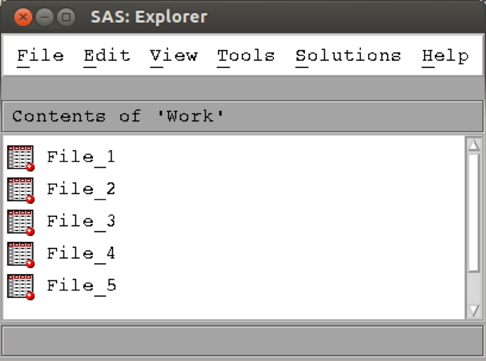

## 4.4 Macro functions

Since all macro variables are text strings it is not possible to directly perform computations on macro variables that contain numbers. The following code would give an error:

    %let var=5**2;

    %put &var;

One must make use of the following function to be able to evaluate (in the macro compiler) such computations:

    %let var=5**2;

    %put %eval(&var);

    %put %sysevalf(&var);

The "%sysevalf" function works in a very similar way to the "%eval" but will compute fractions such as 9/2 in the Real numbers (as opposed to eval which would round the result).

Another use of macro functions is when it comes to ignoring certain SAS keywords. The following code puts two different statements to the log.

    %let myvar=abc;
    %put %str(this string is; &myvar);
    %put %nrstr(this string is; &myvar %let);

The first macro function "%str" ignores the ";" and treats it as a string. The second macro function "nrstr" ignores all the SAS statements including ";,&" and "%".

There are a large number of macro functions and it's worth looking around if you think there's one you might need. Also, of interest are the following commands (look them up) that can help with debugging:

1. mprint

- writes all non-macro code generated by the macro

2. mlogic

- when a macro begins executing
- values of macro parameters
- when program statements execute
- the status of any %if or %do condition
- when a macro stops executing

3. Symbolgen

- writes information concerning the resolution of macro variables to the log

---

# Chapter 5 Further procs

---
In this chapter we will examine three particular procedures in SAS.

1. proc sql: a procedure allowing for the use of sql syntax in SAS;
2. proc fcmp: a procedure allowing for the creation of custom functions;
3. proc optmodel: a package that allows for optimisation in SAS.

## 5.1 Proc sql

### Basic SQL

SQL is a language designed for querying and modifying databases. Used by
a variety of database management software suites:

1. Oracle
2. Microsoft ACCESS
3. SPSS

SQL uses one or more objects called TABLES where: rows contain records (observations) and columns contain variables. Importantly,

1. Starts with proc sql; (as expected)
2. Ends with quit; (some interactive procedures do)

The following code creates a data set called test in the work library as a copy of the mat008.mmm data set:

    proc sql;
    create table test as
    select *
    from mat008.mmm;
    quit;

The "*" command tells SAS to take all variables from mat008.mmm. We can however specify exactly what variables we want:

    proc sql;
    create table test as
    select Name, Age, Sex
    from mat008.mmm;
    quit;

We can also create new variables:

    proc sql;
    create table test as
    select Name, Age, Sex, weight_in_kg/(height_in_metres**2) as bmi
    from mat008.mmm;
    quit;

### Further SQL

In this section we'll take a look at what else SAS can do. For the purpose of the following examples let's write a new data set:

    data mat008.example;
    input Var1 $ Var2 Var3 $ Var 4 Var5 $;
    cards;
    A 1 A 2 B
    A 1 A 2 B
    B 1 A 1 C
    C 2 B 2 D
    C 2 C 1 E
    ;
    run;

Some simple SQL code very easily helps us to get rid of duplicate rows (this can be very helpful when handling real data). To do this we use the "distinct" keyword.

    proc sql;
    create table example as
    select distinct *
    from mat008.example;
    quit;

We can also select particular variables:

    proc sql;
    create table example as
    select distinct var1, var2, var3
    from mat008.example;
    quit;

We can also use the "where" statement to select variables that obey a particular condition:

    proc sql;
    create table example as
    select *
    from mat008.example
    where var2<=var4;
    quit;

We can sort data sets using the "order by" keyword:

    proc sql;
    create table example as
    select distinct *
    from mat008.example
    order by var1;
    quit;

A very nice application of SQL is in the aggregation of summary statistics. The following code creates a new variable that gives the average value of var2. The value of this variable is the same for all the observations:

    proc sql;
    create table example as
    select * mean(var2) as average_of_var2
    from mat008.example;
    quit;

We could however get something a bit more useful by aggregating the data using a "group" statement:

    proc sql;
    create table example as
    select var1, mean(var2) as average_of_var2
    from mat008.example
    group by var1;
    quit;

### Joining tables with SQL

A very common use of SQL within SAS is to carry out "joins" which are equivalent to a merger of data sets. There are 4 types of joins to consider:

1. inner join
    1. output table only contains rows common to all tables
    2. variable attributes taken from left most table
2. outer join left
    1. output table contains all rows contributed by the left table
    2. variable attributes taken from left most table
3. outer join right
    1. output table contains all rows contributed by the right table
    2. variable attributes taken from right most table
4. outer join full
    1. output table contains all rows contributed by all tables
    2. variable attributes taken from left most table

To work with these examples let's use the data sets created with the following code:

    data mat008.dogs;
    input Owner $ Name $;
    cards;
    Jeff Ruffus
    Janet Sam
    Paul .
    Joanna .
    ;
    run;

    data mat008.cats;
    input Owner $ Name $;
    cards;
    Jeff Kitty
    Paul .
    Joanna Tinkerbell
    Vince Chick
    ;
    run;

The following code carries out an inner join of these two datasets also changing the name of the "Name" variable depending on which data set it was from, the output of which is shown.

    proc sql;
    create table merged_table as
    select a.Owner,a.Name as Dog_Name, b.Name as cat_Name
    from mat008.dogs as a, mat008.cats as b
    where a.Owner=b.Owner;
    quit;

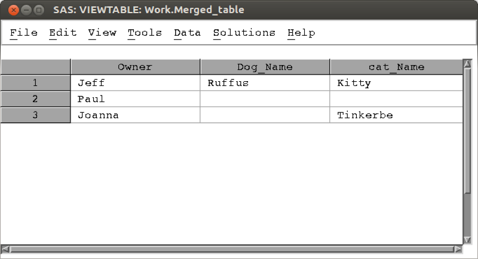

The following code carries out a left outer join, the output of which is shown.

    proc sql;
    create table merged_table as
    select a.Owner,a.Name as Dog_Name, b.Name as cat_Name
    from mat008.dogs as a
    left join mat008.cats as b
    on a.Owner=b.Owner;
    quit;

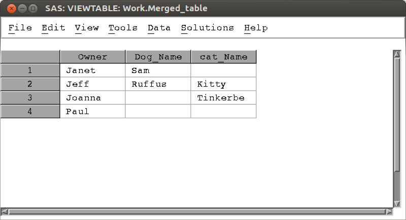

The following code carries out a right outer join, the output of which is shown.

    proc sql;
    create table merged_table as
    select a.Owner,a.Name as Dog_Name, b.Name as cat_Name
    from mat008.dogs as a
    right join mat008.cats as b
    on a.Owner=b.Owner;
    quit;

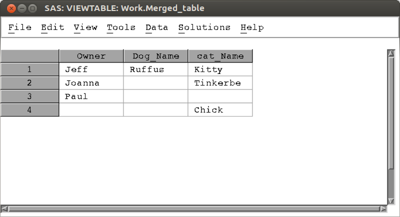

The following code carries out a full outer join, the output of which is shown.

    proc sql;
    create table merged_table as
    select a.Owner,a.Name as Dog_Name, b.Name as cat_Name
    from mat008.dogs as a
    full join mat008.cats as b
    on a.Owner=b.Owner;
    quit;

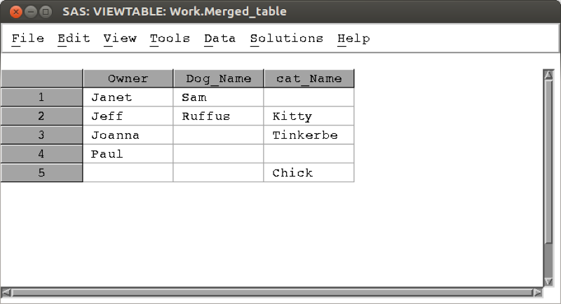

## 5.2 Proc fcmp

In previous chapters we have seen various in built functions in SAS. For various reasons it might be required to create a custom function. We will do this with the "fcmp" procedure. This procedure allows us to create custom functions using data step syntax (which allows for "if" and "do" statements to be used). The following code creates a function called "ln" that gives the natural log of a number:

    proc fcmp outlib=sasuser.funcs.ln;
    function ln(x);
    y=log(x);
    return(y);
    endsub;
    quit;

This code in fact creates a function named "ln" in a package named "funcs". The package is stored in the data set sasuser.funcs. To use this function we need to tell SAS which data set contains the function. We do this with the following piece of code:

    option cmplib=sasuser.funcs;

It is then straightforward to call this function:

    option cmplib=sasuser.funcs;
    data test;
    x=5;
    y=log(x);
    new_Y=ln(x);
    run;

The main advantage to using this procedure is that we can include complex data step syntax. The following function takes two inputs and gives a geometric sum:

    proc fcmp outlib=sasuser.funcs.Gsum;
    function Gsum(i,n);
    s=0;
    do k=0 to n;
    s=s+i**k;
    end;
    return(s);
    endsub;
    quit;

Let's test this on the following data set:

    data test;
    input n i;
    cards;
    1 1
    2 1
    3 2
    4 2
    5 2
    6 2
    ;
    run;

    data G_sum_test;
    set test;
    y=Gsum(i,n);
    run;

## 5.3 Optimisation

Another powerful aspect of SAS is it's optimisation engine. We can optimise various types of problems using the "optmodel" procedure. The following code optimises the polynomial: $x^2-x-yx+y^2$.

    proc optmodel;
    var x,y;
    min z=x**2-x-2*y-x*y+y**2;
    solve;
    print x y;
    quit;

The output is shown, note that SAS automatically chooses a solver (in this case Non Linear Programming and Interior Point methods).

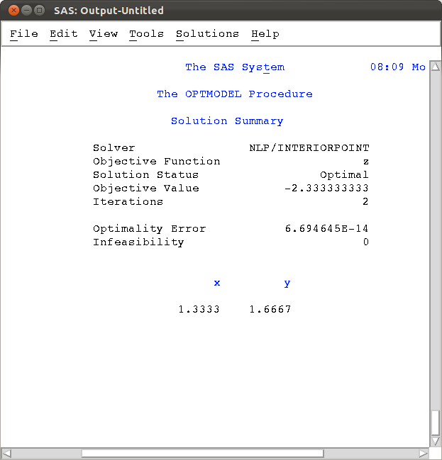

We can also include a domain:

    proc optmodel;
    var x<=0,y>=2;
    min z=x**2-x-2*y-x*y+y**2;
    solve;
    print x y;
    quit;

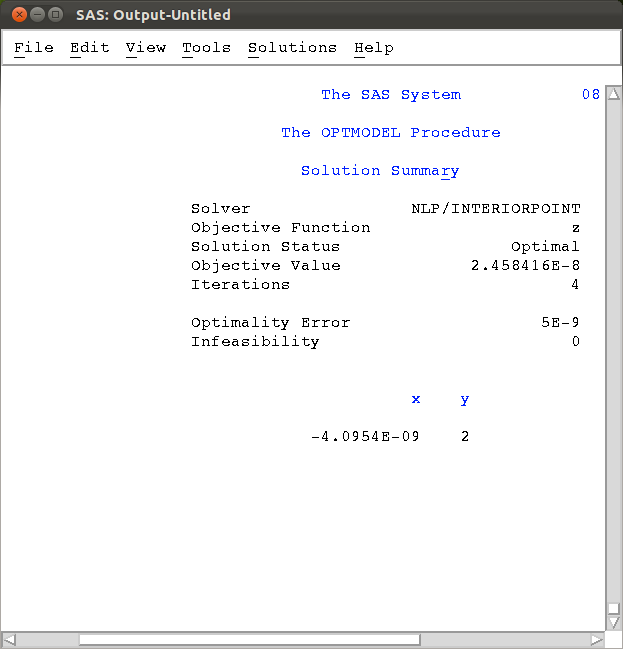

We can solve further more complex optimisation problems, including constraints using the 'constraints' keyword:

    proc optmodel;
    var x1>=0, x2>=0, x3>=0;
    max f=x1+x2+x3;
    constraint c1: 3*x1+2*x2-x3<=1;
    constraint c2: -2*x1-3*x2+2*x3<=1;
    solve;
    print x1 x2 x3;
    quit;

The output is shown (note the solver used was a variant of simplex).

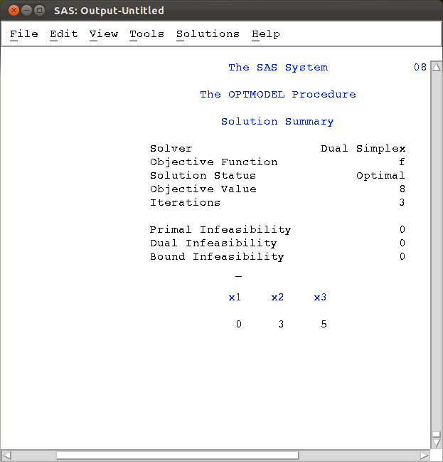

It is also possible to read in the constraints of a particular optimisation problem from a data set. This can prove to be very handy when dealing with huge problems so it's worth spending time researching that approach.
