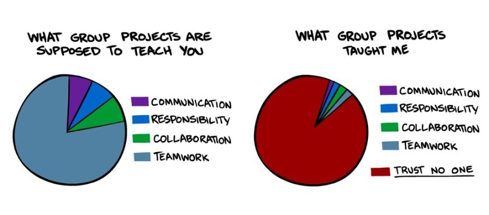

#MAT013

#Robert Lee Moore (1882-1972):

> "That student is taught the best who is told the least."

#Flipped Classroom

#Moore Method

**Inquiry Based Learning**

In general student led learning through:

- Problems
- Presentations

**Requires student buy in!**

#The Plan

Class schedule:

- 0900 - 0920: Group presents solution to challenge (R)
- 0920 - 0940: Class discussion (R)
- 0940 - 1040: Lab session (R)
- 1040 - 1100: Break
- 1100 - 1120: Group presents solution to challenge (SAS)
- 1120 - 1140: Class discussion (SAS)
- 1140 - 1240: Lab session (SAS)

#Incentives

Recall:

- Class Test: 40%;
- Individual Coursework: 30%; **I'm giving you 25% of this.**
    - Participate in discussion
- Group Coursework: 30%; **I'm giving you 25% of this.**
    - Present solutions to challenge.

#Example R Challenge

The data set `Data_for_Analysis.csv` contains data of simulated game play for the game "shut the box" (for info see this [blog post](http://goo.gl/zViSX)). Rows of the file correspond to instances of play. Columns correspond to variables corresponding to each of the 4 strategies:

- The score for each strategy
- The number of turns for each strategy

Which strategy seems to be the best?

#Example Challenge Solution

<iframe src="Example_Challenge_Solution.html" width="700" height="500"></iframe>

#Course Materials

[www.vincent-knight.com](www.vincent-knight.com)

#Group work "issues"

#Group work "issues"

- A lot of literature on the subject:

Lejk, M., Wyvill, M., & Farrow, S. (1996). A Survey of Methods of Deriving Individual Grades from Group Assessments. Assessment & Evaluation in Higher Education, 21(3).

- We will use a game theoretical approach.

#Summary

- Flipped classroom approach;
- IBL approach;
- Needs your buy in to work.
